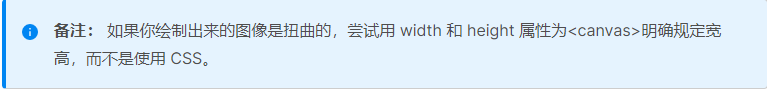

## canvas 绘制
> 参考链接 [mdn canvas](https://developer.mozilla.org/zh-CN/docs/Web/API/Canvas_API/Tutorial/Drawing_shapes)

- canvas只支持两种图形绘制，一个是矩形一个是路径，但是路径提供了非常多的方法，可以生成一些复杂的图形。绘制矩形有三种方法，一个生成填充的矩形，一个生成描边的矩形，一个则是生成透明区域的矩形(相当于清空一块矩形区域)

- canvas绘制的路径只要是闭合的，就能通过填充和描边来上色。canvas路径绘制的图形会自动闭合，例如一个三角形就绘制了两条线，那么这两条线也会自己闭合为一个完整的三角形。

- canvas 需要使用多张图片时，可使用图片预加载技术

