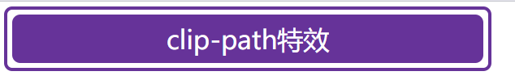
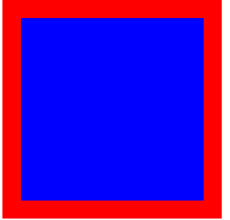

> 日常在实现clip-path动画时发现，子盒子可以通过与父盒子之间的定位来控制大小
> 参考链接 https://blog.csdn.net/android_boom/article/details/124929059
> 31/08/2022 11:57

## 网上案例分析
### 通过clip-path实现流动特效
```html

<!DOCTYPE html>
<html lang="en">

<head>
    <meta charset="UTF-8">
    <meta http-equiv="X-UA-Compatible" content="IE=edge">
    <meta name="viewport" content="width=device-width, initial-scale=1.0">
    <title>clip-path</title>
</head>

<body>
    <div class="box">clip-path特效</div>
</body>
<style>
    .box {
        position: relative;
        background: rebeccapurple;
        line-height: 30px;
        padding: 0 20px;
        color: #fff;
        border-radius: 5px;
        width: 250px;
        text-align: center;
    }

    .box::after {
/*      子盒子不设置宽高，通过调整与父盒子四个边的距离来改变大小 */
        content: "";
        border: 2px solid rebeccapurple;
        position: absolute;
/* 		这边四个-5px的代表子盒子的四条边都超出父盒子5px，因为是相对父盒子来决定位置的 */
        top: -5px;
        left: -5px;
        right: -5px;
        bottom: -5px;
        animation: clipPath 3s infinite linear;
        border-radius: 5px;
    }

    @keyframes clipPath {

        0%,
        100% {
            clip-path: inset(0 0 96% 0);
        }

        25% {
            clip-path: inset(0 96% 0 0);
        }

        50% {
            clip-path: inset(96% 0 0 0);
        }

        75% {
            clip-path: inset(0 0 0 96%);
        }
    }
</style>

</html>

```

###  效果图

 - 没有加动画
 
 - 加动画
 
 

## 自我案例探究
### 通过定位来决定子盒子的大小
```html
<!DOCTYPE html>
<html lang="en">

<head>
    <meta charset="UTF-8">
    <meta http-equiv="X-UA-Compatible" content="IE=edge">
    <meta name="viewport" content="width=device-width, initial-scale=1.0">
    <title>定位撑开盒子</title>
</head>

<body>
    <div class="father">
        <div class="son">

        </div>
    </div>
</body>
<style>
    .father {
        position: relative;
        width: 600px;
        height: 600px;
        background-color: red;
    }

    .father>.son {
        position: absolute;
        left: 50px;
        right: 50px;
        bottom: 50px;
        top: 50px;
        background-color: blue;
    }
</style>

</html>
```

### 效果图
> 蓝色盒子是没有设置宽高的，但是它的每一条边都距离红色盒子50px，导致了蓝色盒子的大小被拉伸


## 总结

==定位确实可以改变盒子的大小，想要达到这个目的只需要同时设置left，right或者top，bottom，两个相反的属性同时设置就可以拉伸盒子原本的宽度和高度！！！这个发现在一些场景中非常好用！==

