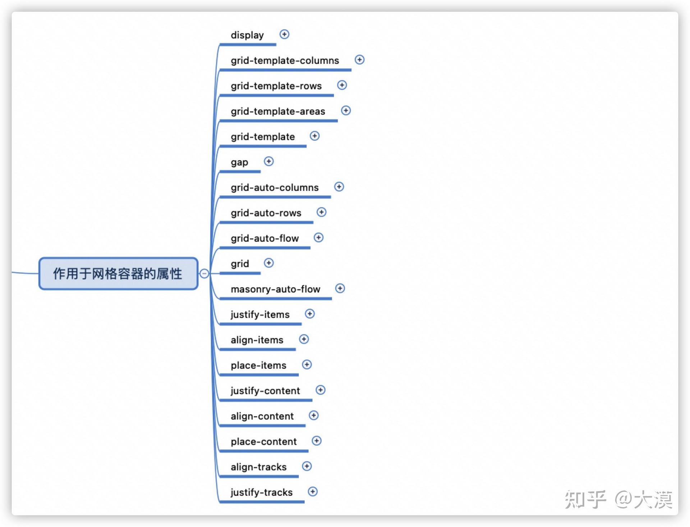

> 参考mdn链接：[grid布局](https://developer.mozilla.org/en-US/docs/Web/CSS/CSS_Grid_Layout)
## grid 网格布局的属性

这里面没有 grid-row-start | grid-column-start | grid-row-end | grid-column-end

grid-area ：grid-row-start | grid-column-start | grid-row-end | grid-column-end； 可以接收四个属性
也可以直接指定划分区域的名称

grid-row | grid-column 指定一个数字的意思是第几个格子，指定 start/end 就是从第几条线到第几条线，
span 数字 就是跨越几格

例如 grid-row:2 就是指第一列的第二行的格子
grid-row ：2/3 就是行方向的 第二条网格线到第三条网格线之间的格子
grid-row ： span 2 就是行方向 横跨2个格子

min-conten属性代表内容的最小尺寸，max-content代表内容最大尺寸，就比如说行内样式的文字长度。