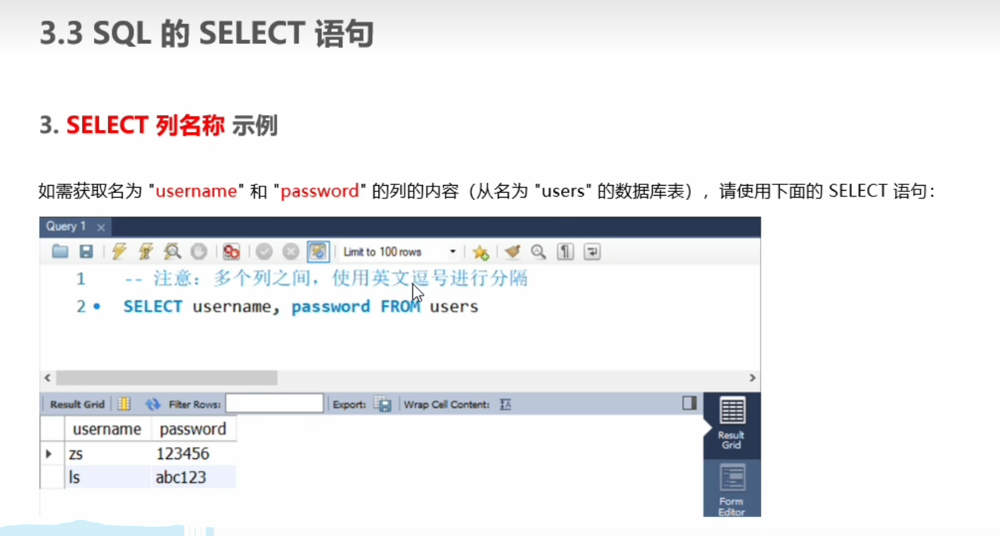

## sql
1.  什么是数据库
    
2.  主流数据库
    
3.  传统型数据库类型关系
    

4. mysql 软件需求

5. 创建数据表

6. sql 语言
7. sql能干什么

8. sql 学习目标

## sql是编程语言，很多种数据库都能用
1. select from 查询数据表

2. inset into 插入一行数据
3. update 更改数据表信息

4. delete 删除不想要的数据