> 主流的两种方式

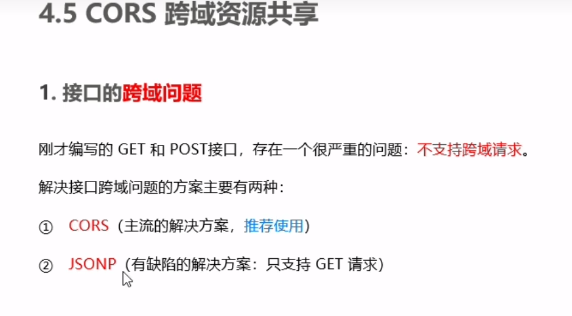

1. CORS
- cors 解决跨域问题，通过配置http响应头配置跨域，只需在服务器端配置，不需要在客户端配置。
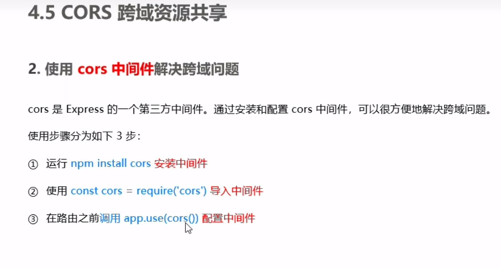
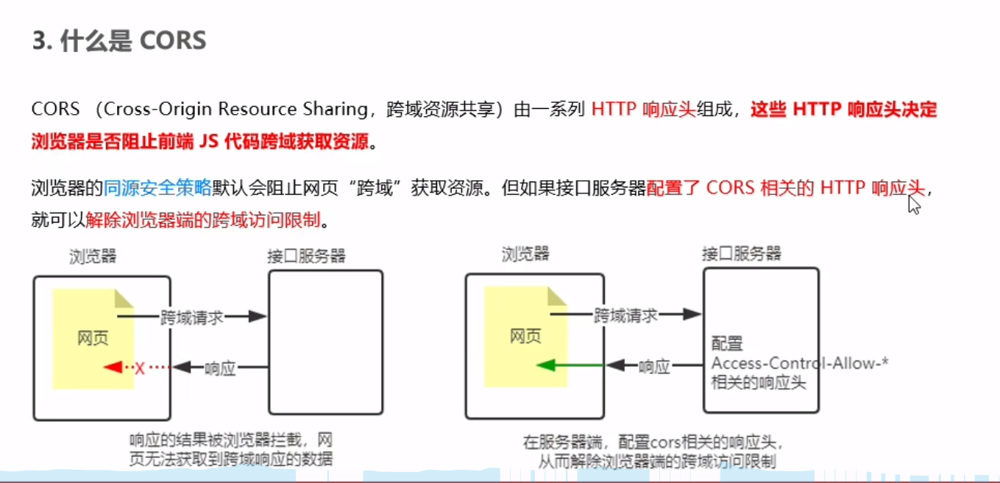
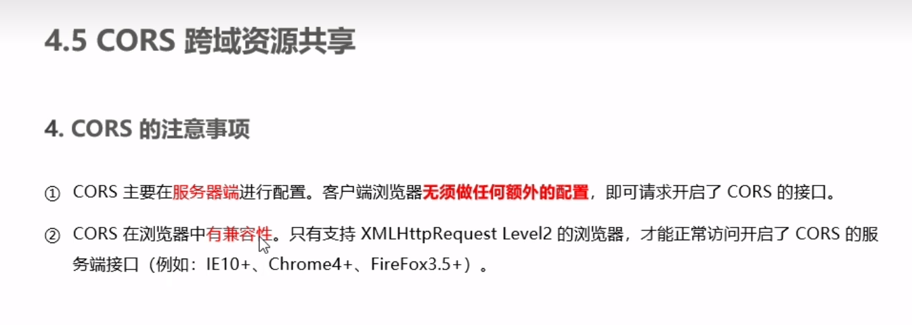
- cors响应头的具体配置
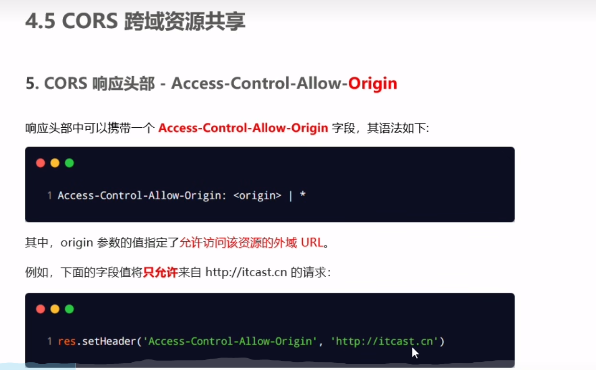
-cors注意事项
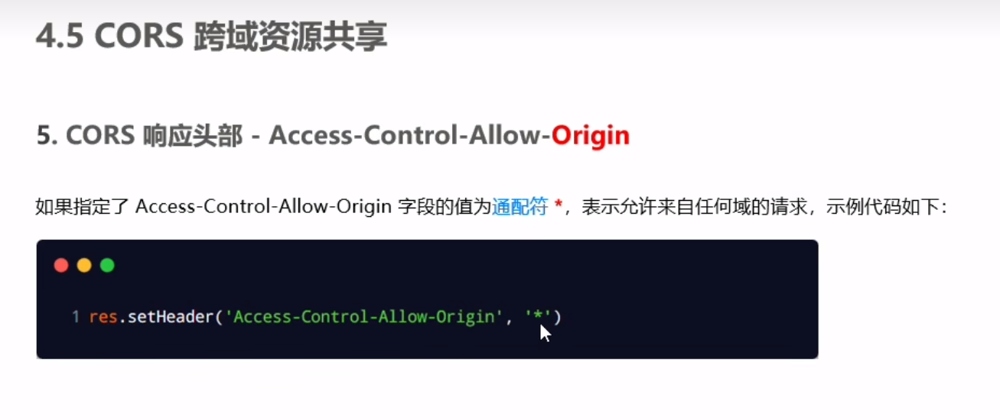
- 更多的请求方式
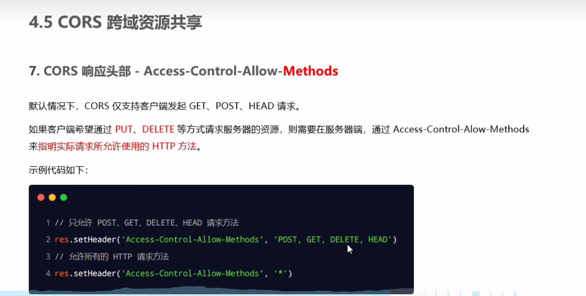
- cors包含九种响应头，如果想要设置不包含在内的响应头，就得手动去配置。
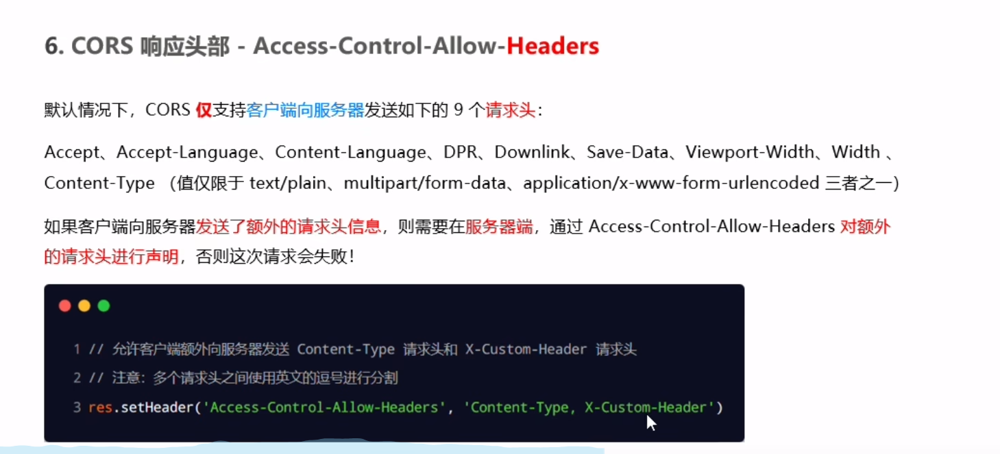
- 简单请求对立面-预检请求
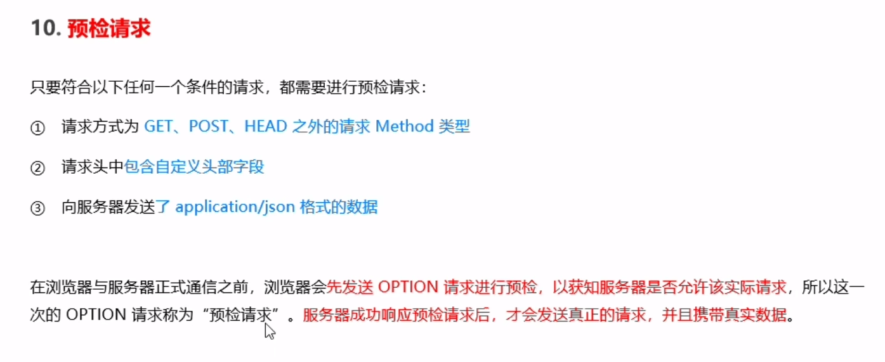
- 简单请求与预检请求的区别
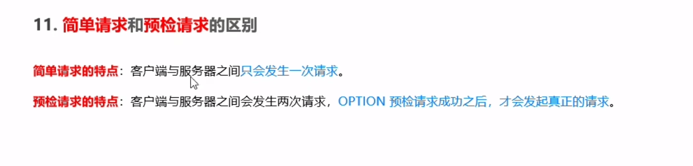
3. JSONP
- jsonp请求
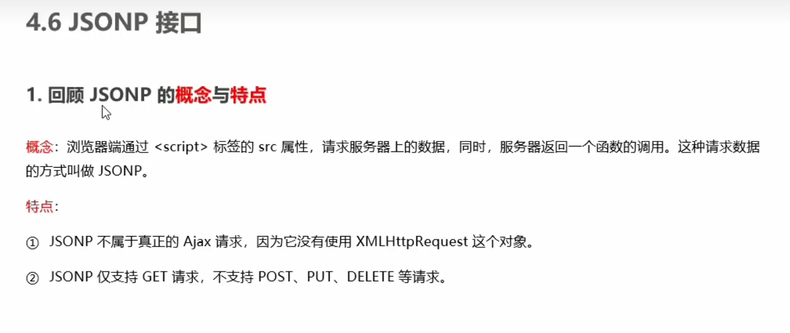
- jsonp跨域注意事项
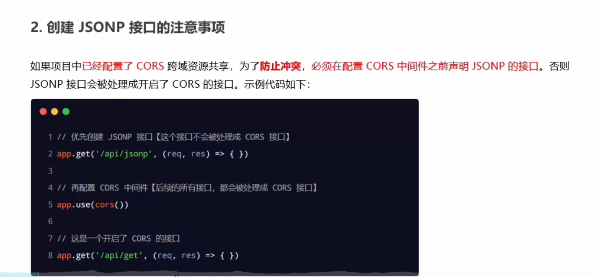
- jsonp跨域实现步骤
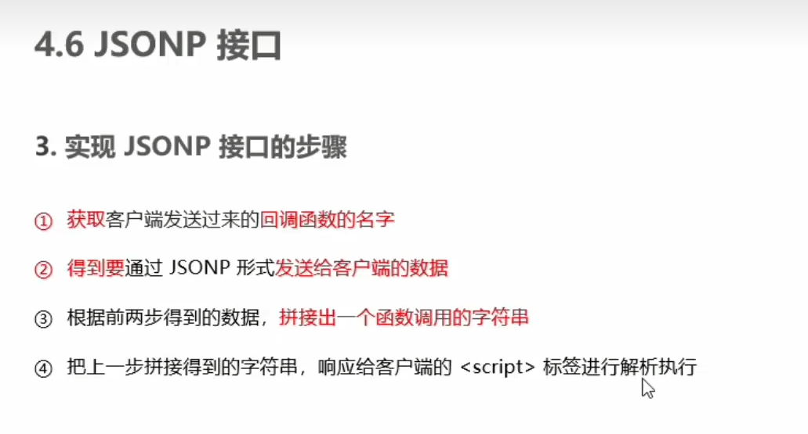
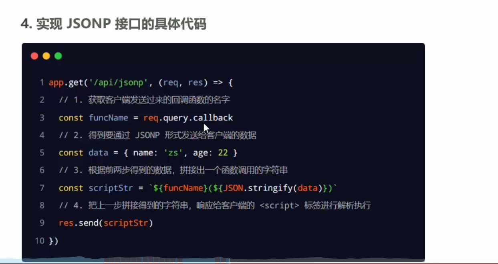
