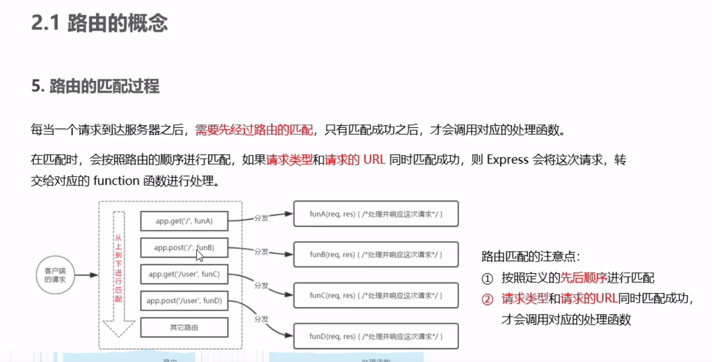
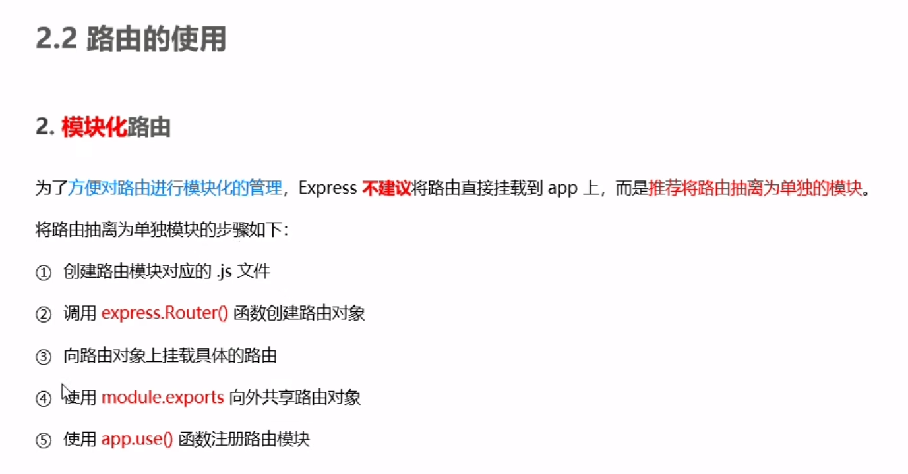
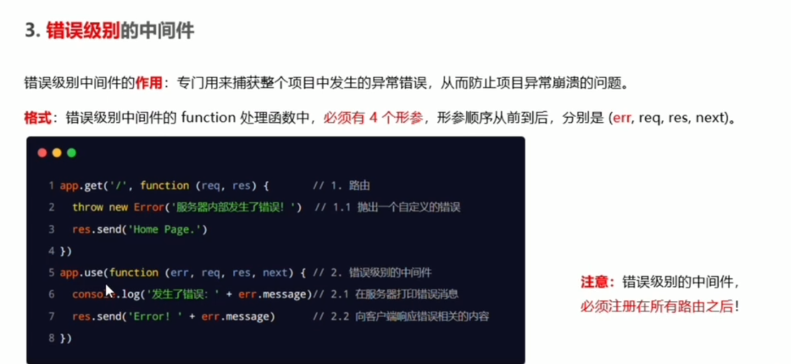

## express学习目标
> ## ==注意 ： app.use()函数的作用就是用来注册全局中间件。==

### express介绍

### express 作用

- app.get 监听get请求

- app.post 监听post请求

- res.send()将请求到的数据发送给客户端
- 简易版app.get和app.set请求
```javascript
//下面的代码是 app.get()和app.post的简易封装。

   const http = require('http');
   const server = http.createServer();
   server.on('request', (req, res) => {
      const url = req.url;
      console.log(req.method)
      if (req.method === 'GET') {
          if (url === '/user') {
              res.end(JSON.stringify({ name: '陈子文', age: 22, sex:'男'    }))
          }
      }
      else if (req.method === 'POST') {
          if (url === '/user') {
              res.end('请求成功')
          }
      }
   })
   server.listen(8080, () => {
      console.log('web server running at http://127.0.0.1:8080')
   })
```
### 获取url中携带的参数
- req.query 

- req.parmas

### ==托管静态资源(这个好)==
> express.static() 挂在静态资源文件
1. 挂载单个静态资源

2. 挂载多个静态资源文件

3. 挂在路径前缀

4.使用nodeman

### express 路由
1. 路由匹配

2. 路由模块化步骤

3. 路由模块化实操

4. 路由前缀，与静态资源前缀同理

5.express 中间件
   - 中间件比喻
   
   - 中间件概念
   
   - 请求函数包含next() 函数 就说明它是一个中间件，否则就是一个路由处理函数
   
   - 定义中间件函数
   
   - 定义全局中间件
   
   - 中间件的作用
   
      - 中间件跟下级的req，res是共享的，写在这个就可以在下一个中间件中使用。
	  
	  - 定义单个局部中间件
	  
	  - 定义多个局部中间件
	  
### 中间件的五项注意点（单独一大列）

1. 应用级中间件

2.路由级别中间件

3.错误级别中间件
> ==有四个参数，必须定义在路由之后，不然程序不执行==



4. express 内置中间件

   - express.json 中间件
   
   - express.urlencode 中间件
   
   5. 第三方中间件 （案例介绍）
   
### 自定义中间件
1. 基本步骤

2. 监听并拼接数据


	  