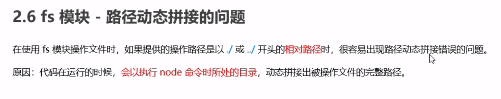

## 1.fs文件读写模块
>==语法中的中括号代表可选项==
### 读取文件
> ==一三为必选参数项，二为可选参数。参数一为文件路径，参数二为可选参数，表示以什么编码格式来读取文件，参数三为回调函数，当文件读取成功后，通过它来拿到读取结果。==
- **`fs.readFile()可以读取指定文件中的内容`**
   - **语法： `fs.readFile(path,[,options],callback)`**
 
 ### 编写文件
 > ==一二四为必选参数项，三为可选参数。参数一为存放文件路径，参数二为写入内容。参数三为可选参数，表示以什么编码格式来写入内容，默认为utf8，参数四为成功或失败的回调函数。==
- **`fs.writeFile()可以读取指定文件中的内容`**
   - **语法：`fs.writeFile(file,data[,options],callback)`**

## 2. fs文件系统模块
- 路径拼接问题

- 可以使用绝对路径，就不会出现拼接问题，但可移植性非常差，不推荐。
- 完美解决方案
   - __dirname (双下划线dirname表示当前文件所处的目录，非常的好用)

 
 