## npm包管理

- 下载指定版本号加一个@符
- 包版本号详解
    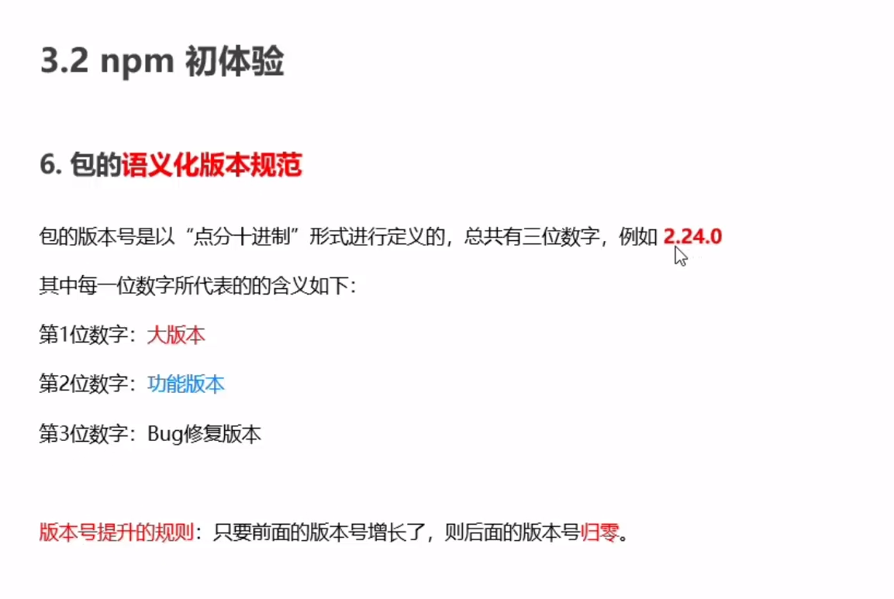

## npm 重点

> ==通过下述代码去生成依赖文件，项目上传到github时就可以通过这些依赖来精准的下载需要的包。==

- node项目执行`npm install`会生成package.lock.json（重要）
- node项目执行`npm init -y`会生成package.json （重要）

## 开发依赖与依赖区分

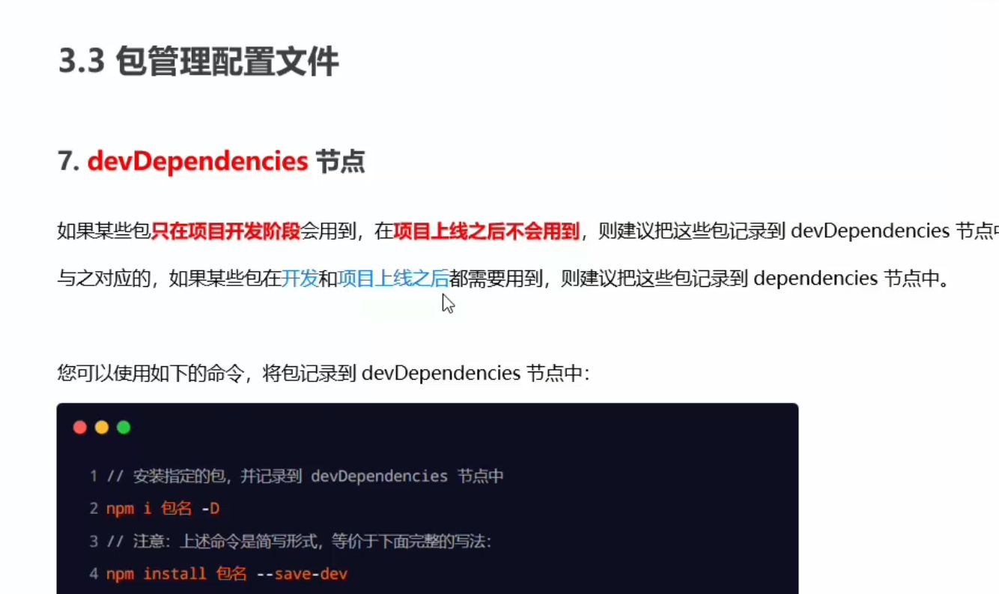

## 下包慢问题

- 根据下图切换为淘宝镜像，提高下载速度。
    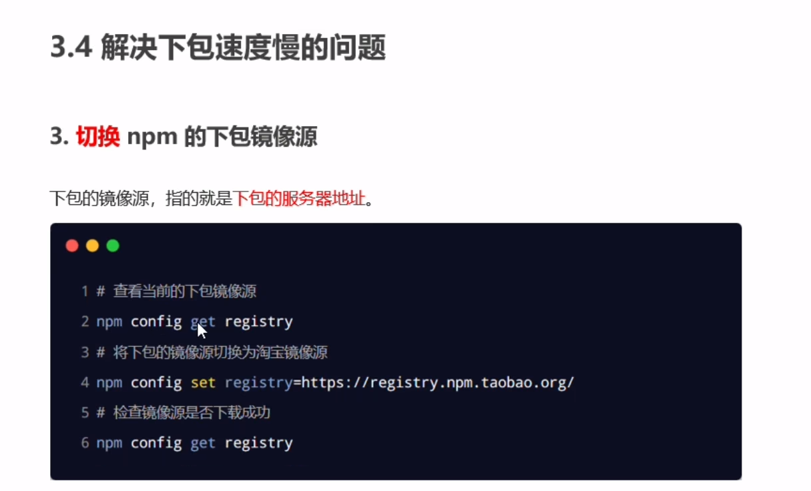
- nrm 镜像管理工具
    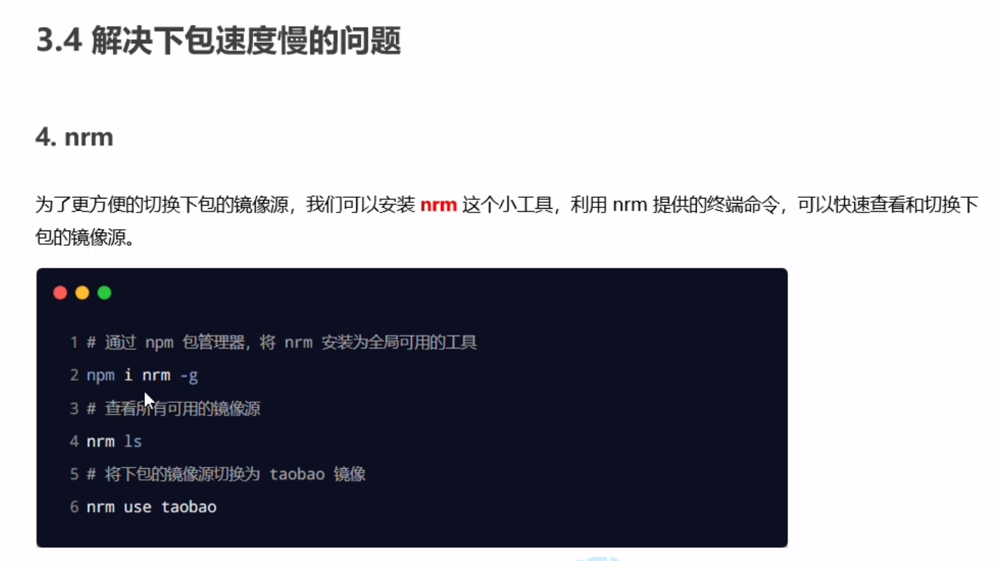

## npm 包分类

- 项目包分两类
    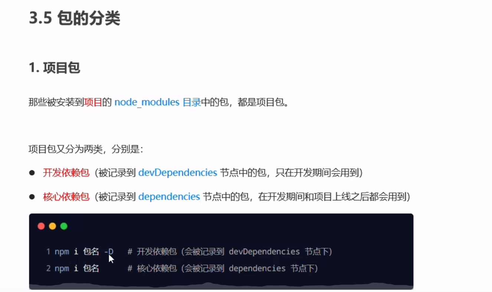
- 全局包
    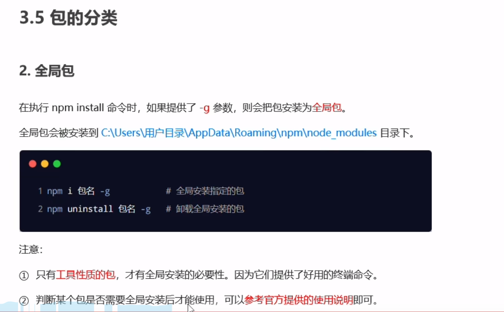
- i5ting_toc 可以将md文档转为html （牛逼）
    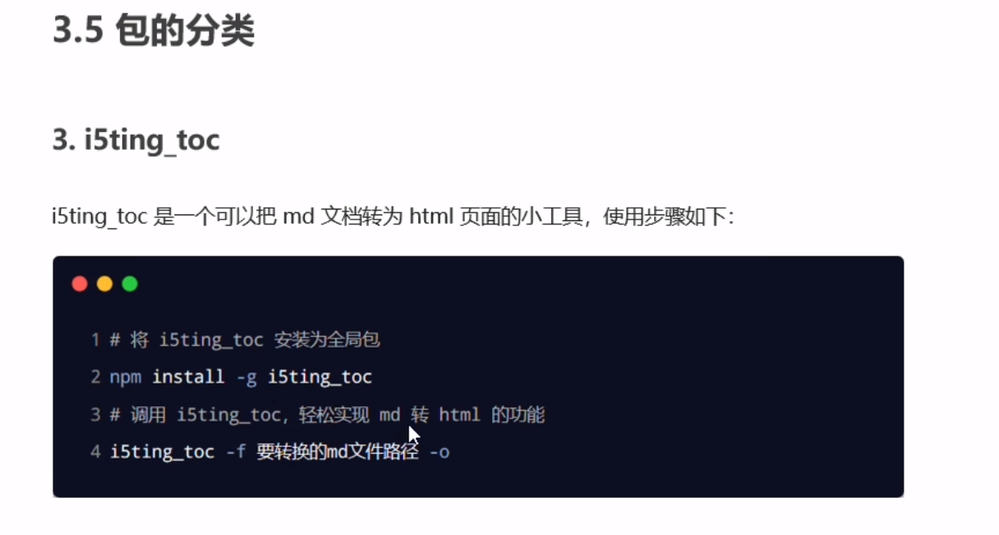

## 开发属于自己的包

> 包必须严格按照规范来实现

### 包的规范

- 包的一些基本规范
    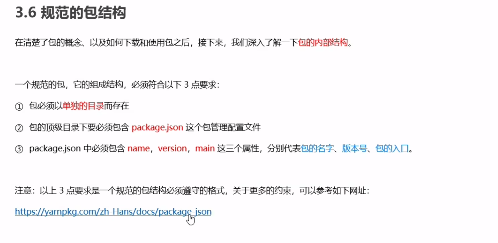
    
- 包的案例截图
    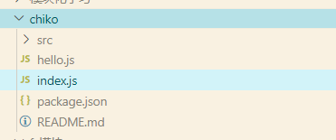
    
- 总结一下包需要哪些要求
    
    1.  包必须为一个单独的文件夹。
    2.  index.js 为入口文件，package.json 为依赖，README.md为介绍。
    3.  可以将类似功能的函数拆分到不同的.js文件中，再通过require导入到index.js主入口文件中。
    4.  在终端执行npm login 登陆，按照要求输入账号、密码、邮箱。需要注意的是不能使用镜像，必须使用npm 官方路径。
    5.  发布只需要打开包的根目录终端，输入npm publish 即可成功把包上传到npm。
- 删除发布的包
    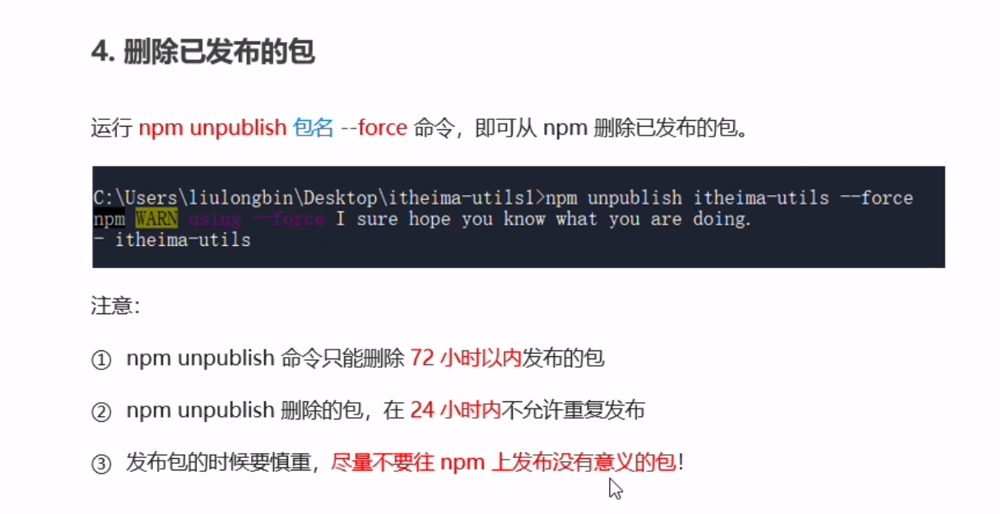
    

## 模块优先缓存加载

1.  require执行多次相同代码，只执行第一次
    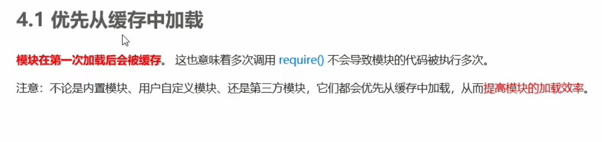
2.  内置模块优先级最高
    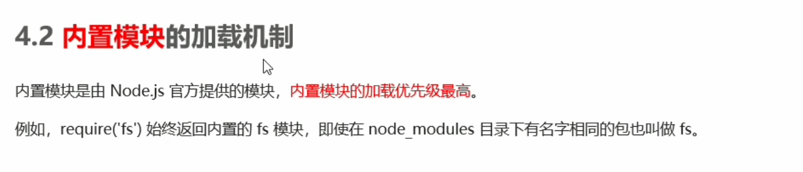
3.  自定义模块必须用相对路径，不然系统会把他误认为是内置模块或第三方模块。
    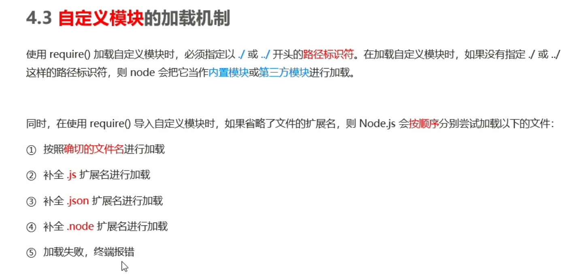
4.  第三方模块判定机制
    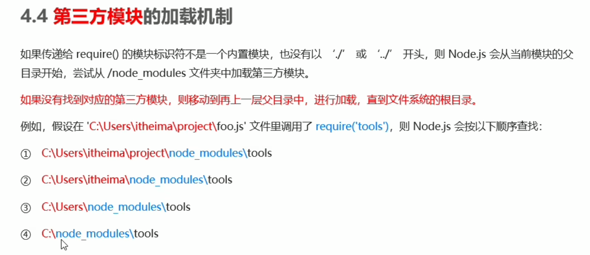
5.  目录作为模块
    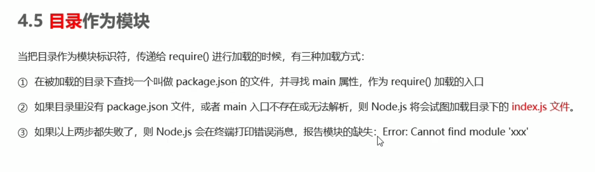