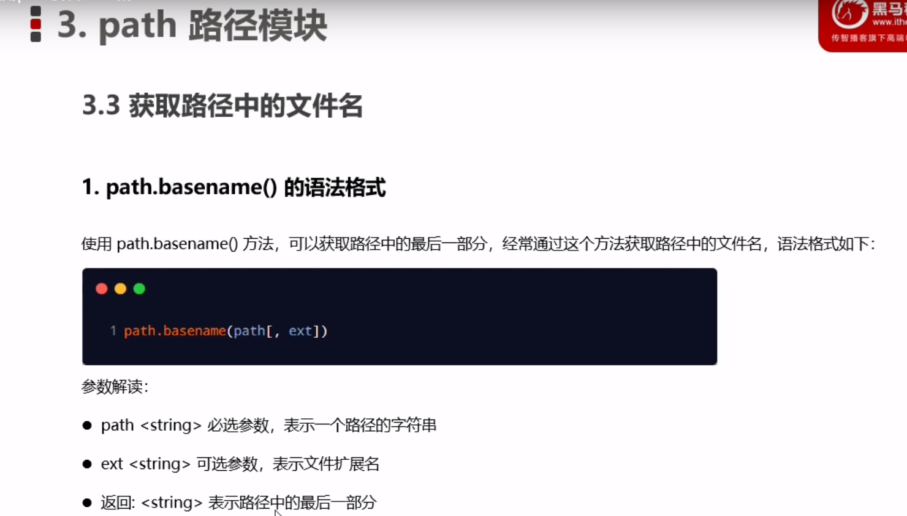

## 1.路径方法
> ### ==今后凡是遇到需要路径拼接的都需要使用path.join()来拼接，不要使用+号==

### 1.path.join() 路径拼接
> **因为  . . /  可以抵消上一层路径，配合__dirname使用，就可以获取到任意的路径地址了，例如：__dirname的路径为 /a/b/c/d， 但我想要访问/a/b/c路径下的czw.txt文件，这个时候只需要抵消一层__dirname路径即可。案例如下：
 ==path.join(__dirname，../，'/czw.txt')==**

### 2.path.basename() 获取路径中文名
> **==加上可选参数，可以去除扩展名==**

### 3.path.extname() 获取路径扩展名
