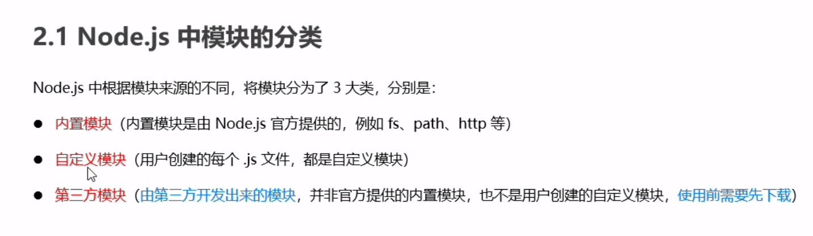
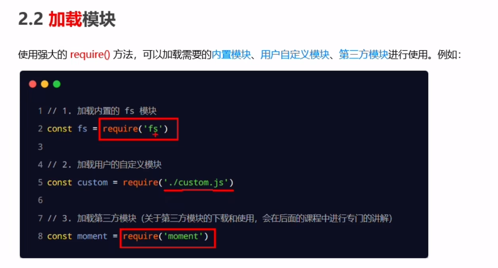
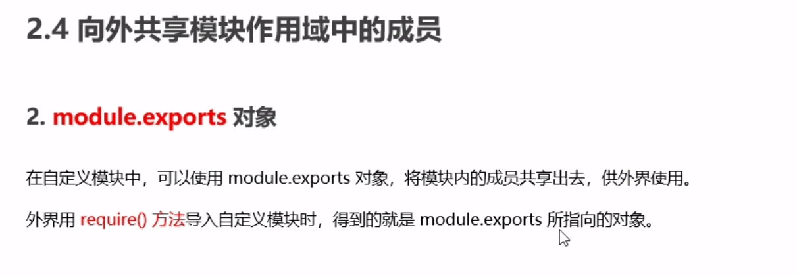
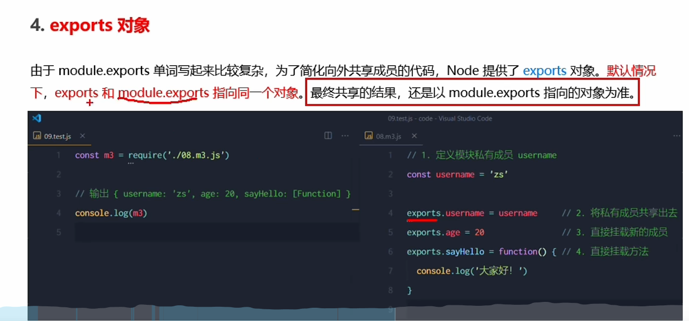
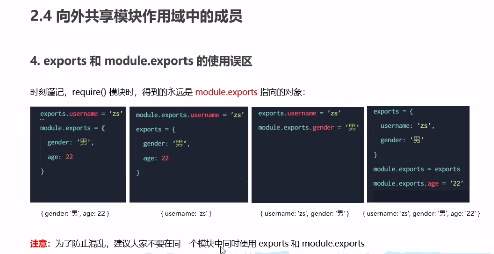
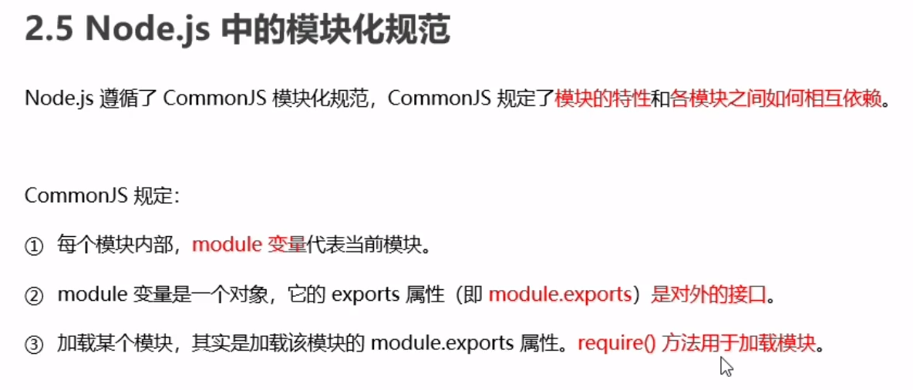

## 三大模块

### 加载模块

### require知识点
- 当我们使用require导入模块时，路径使用相对路径，例如 ./a/b. ，且.js后缀可以省略，同时呢，被引入的模块会自动调用。
- 使用require导入模块时，默认导入的是该模块中的module.exportsd对象，也就是`module.exports={}`，所以如果module.exports没有暴露数据的化，require引入的也就是空对象。
- module.exports可以简写成exports

- ==永远以module.exports的指向为准。==

### commonjs 规范

