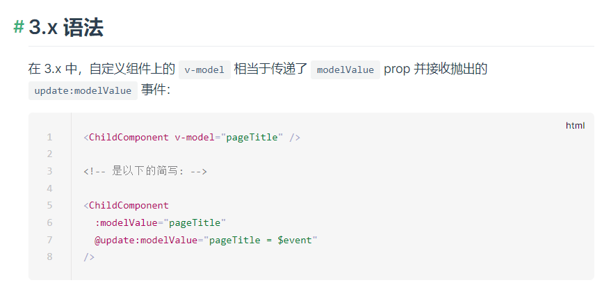
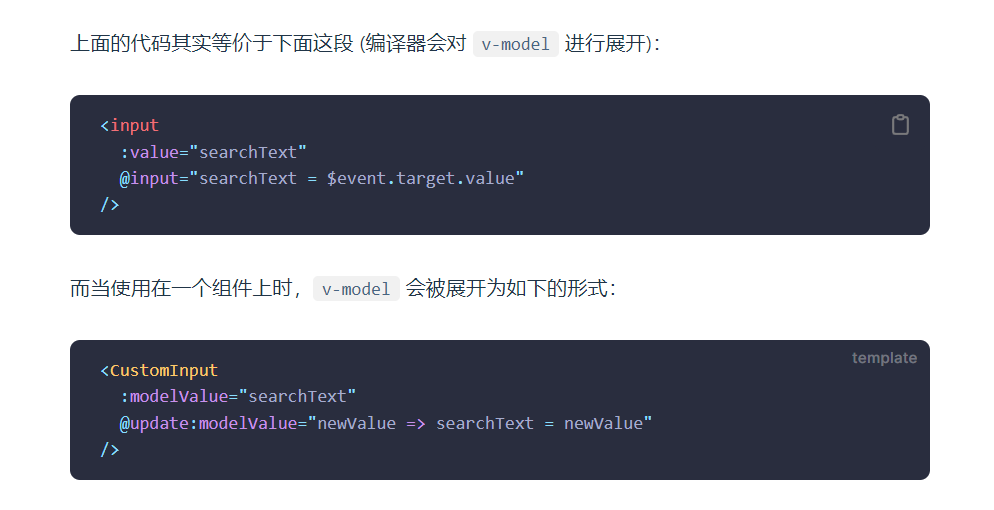

> 在开发中，有的时候组件比较多，就需要通过props和emit来传递数据，但是如果想要子组件和父组件的中有某一个数据能做到共享，v-model双向绑定是比较好的一种方式。被绑定的数据不管是在子组件或是在父组件中被修改都会做到子父组件中同时修改。

> 参考链接：https://blog.csdn.net/Liberty_yes/article/details/124630355

## 用法
- 子组件
```vue

例如：在子组件中，需要通过emit将dialogVisible数据传递给父组件，同时在props中接收父组件传递过dialogVisible参数。

<template>
    <el-dialog v-model="dialogVisible" title="我是一个弹框">
        <p>我是弹框的内容</p>
        <el-button @click="confirm">关闭弹框</el-button>
    </el-dialog>
</template>
<script setup>
const props = defineProps({
	dialogVisible:{
		type:Boolean,
		required:true
	}
});
const emit = defineEmits(["update:dialogVisible"]);
const confirm = ()=>{
	emit('update:dialogVisible',false)
};
</script>

 
```

- 父组件
```vue
在父组件中通过v-model去接收子组件传递过来的dialogVisible值，同时将dialogVisible通过v-bind的形式传递给子组件，形成闭环。

v-model:dialogVisible="dialogVisible"等同于
v-bind="dialogVisible"和 @update:dialogVisible = $event.target.value

<template>
    <h1>父组件</h1>
    <el-button @click="showDialog">点击展示弹框</el-button>
    <Dialog v-model:dialogVisible="dialogVisible" />
</template>
<script setup>
import { Dialog } from "@components/Dialog.vue";

const dialogVisible = ref(false);
const showDialog = () => {
    dialogVisible.value = true;
};
</script>
```

==04/08/2022 11:39 补充==


> 参考链接：https://blog.csdn.net/Liberty_yes/article/details/124630355
> 上面这张图很重要 在vue3.0中 v-model 的性质变了，其实之前都介绍过了，这边再记忆一下。

1. value 改为modelValue，modelValue和input标签的value挂钩，如果不叫modelValue则不跟value挂钩。  例如：v-model：chiko = 'czw' 跟input标签的value属性就没有任何的关系，v-model：chiko = 'czw' 等同于 ：chiko ='czw' 加上 @update：chiko = 'czw = $event'。@click="$emit('update:autoPlay', !autoPlay)" 可以用v-model：autoPlay = autoPlay 去接收因为v-model：autoPlay = autoPlay  等同于v-bind：autoPlay=autoPlay 加上 @updata：autoPlay = autoPlay。
2. v-model 想要完成数据的共享，父组件必须通过emit将值传给子组件，同时子组件必须把emit接收到的值再通过props传递给父组件，这样就形成了一个闭环，最终才能让一个数据在父子组件之间共享。
3. 事件的含义就是必须绑定一个回调函数，在某种条件下，就会触发这个函数，不管事js内置的click事件还是vue自定义的clear事件，最终的目的就是触发某一个回调函数。
4. 


