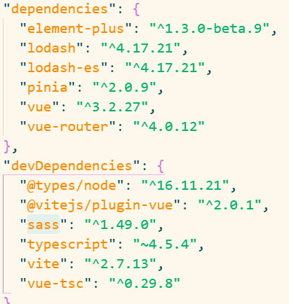

### npm 依赖关系和开发依赖项

- devDependencies 为开发依赖项
   - 我的理解就是开发依赖只在开发中被需要，例如sass和typescript，它们最终会被编译成css和js。所以开发依赖项的作用就是帮助项目的快速开发例如sass或者是对js进行类型检测，例如typescipt等等还有非常非常多的扩展，上线的时候就不需要这些依赖了，因为它们已经被全部打包到项目中了。
   - 官方的解释就是，开发的时候需要，上线时不需要的依赖。