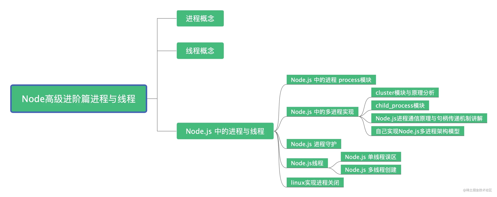
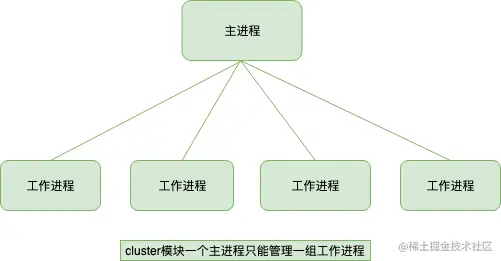
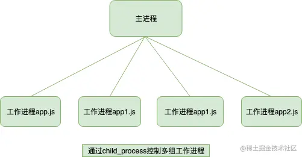
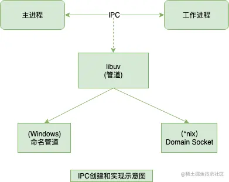
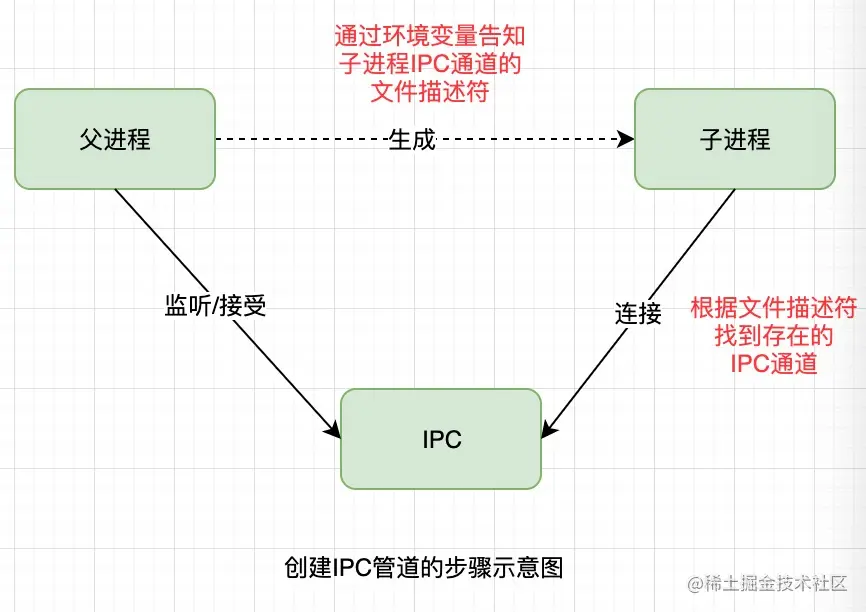
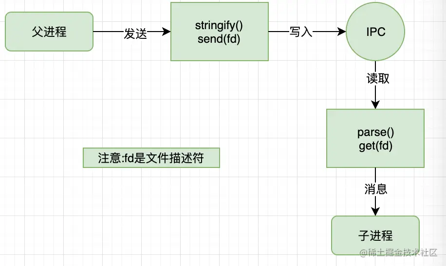
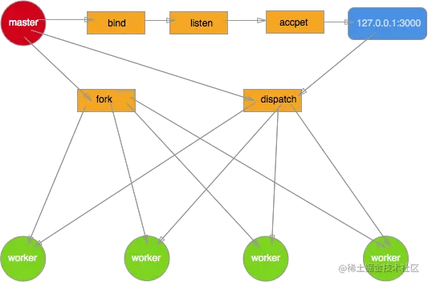
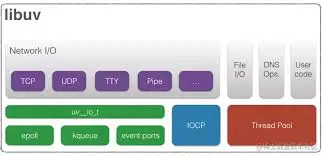

# 深入理解Node.js 中的进程与线程

## 前言

`进程`与`线程`是一个程序员的必知概念，面试经常被问及，但是一些文章内容只是讲讲理论知识，可能一些小伙伴并没有真的理解，在实际开发中应用也比较少。本篇文章除了介绍概念，通过Node.js 的角度讲解`进程`与`线程`，并且讲解一些在项目中的实战的应用，让你不仅能迎战面试官还可以在实战中完美应用。

## 文章导览



作者简介：koala，专注完整的 Node.js 技术栈分享，从 JavaScript 到 Node.js,再到后端数据库，祝您成为优秀的高级 Node.js 工程师。【程序员成长指北】作者，Github 博客开源项目 [github.com/koala-codin…](https://link.juejin.cn?target=https%3A%2F%2Fgithub.com%2Fkoala-coding%2FgoodBlog "https://github.com/koala-coding/goodBlog")

## 面试会问

> Node.js是单线程吗？

> Node.js 做耗时的计算时候，如何避免阻塞？

> Node.js如何实现多进程的开启和关闭？

> Node.js可以创建线程吗？

> 你们开发过程中如何实现进程守护的？

> 除了使用第三方模块，你们自己是否封装过一个多进程架构?

## 进程

进程`Process`是计算机中的程序关于某数据集合上的一次运行活动，是系统进行资源分配和调度的基本单位，是操作系统结构的基础，进程是线程的容器（来自百科）。进程是资源分配的最小单位。我们启动一个服务、运行一个实例，就是开一个服务进程，例如 Java 里的 JVM 本身就是一个进程，Node.js 里通过 `node app.js` 开启一个服务进程，多进程就是进程的复制（fork），fork 出来的每个进程都拥有自己的独立空间地址、数据栈，一个进程无法访问另外一个进程里定义的变量、数据结构，只有建立了 IPC 通信，进程之间才可数据共享。

- Node.js开启服务进程例子

```
const http = require('http');

const server = http.createServer();
server.listen(3000,()=>{
    process.title='程序员成长指北测试进程';
    console.log('进程id',process.pid)
})
复制代码
```

运行上面代码后，以下为 Mac 系统自带的监控工具 “活动监视器” 所展示的效果，可以看到我们刚开启的 Nodejs 进程 7663


## 线程

线程是操作系统能够进行运算调度的最小单位，首先我们要清楚线程是隶属于进程的，被包含于进程之中。**一个线程只能隶属于一个进程，但是一个进程是可以拥有多个线程的**。

### 单线程

**单线程就是一个进程只开一个线程**

Javascript 就是属于单线程，程序顺序执行(这里暂且不提JS异步)，可以想象一下队列，前面一个执行完之后，后面才可以执行，当你在使用单线程语言编码时切勿有过多耗时的同步操作，否则线程会造成阻塞，导致后续响应无法处理。你如果采用 Javascript 进行编码时候，请尽可能的利用Javascript异步操作的特性。

#### 经典计算耗时造成线程阻塞的例子

```
const http = require('http');
const longComputation = () => {
  let sum = 0;
  for (let i = 0; i < 1e10; i++) {
    sum += i;
  };
  return sum;
};
const server = http.createServer();
server.on('request', (req, res) => {
  if (req.url === '/compute') {
    console.info('计算开始',new Date());
    const sum = longComputation();
    console.info('计算结束',new Date());
    return res.end(`Sum is ${sum}`);
  } else {
    res.end('Ok')
  }
});

server.listen(3000);
//打印结果
//计算开始 2019-07-28T07:08:49.849Z
//计算结束 2019-07-28T07:09:04.522Z
复制代码
```

查看打印结果，当我们调用`127.0.0.1:3000/compute` 的时候，如果想要调用其他的路由地址比如127.0.0.1/大约需要15秒时间，也可以说一个用户请求完第一个`compute`接口后需要等待15秒，这对于用户来说是极其不友好的。下文我会通过创建多进程的方式`child_process.fork` 和`cluster` 来解决解决这个问题。

#### 单线程的一些说明

- Node.js 虽然是单线程模型，但是其基于事件驱动、异步非阻塞模式，可以应用于高并发场景，避免了线程创建、线程之间上下文切换所产生的资源开销。
- 当你的项目中需要有大量计算，CPU 耗时的操作时候，要注意考虑开启多进程来完成了。
- Node.js 开发过程中，错误会引起整个应用退出，应用的健壮性值得考验，尤其是错误的异常抛出，以及进程守护是必须要做的。
- 单线程无法利用多核CPU，但是后来Node.js 提供的API以及一些第三方工具相应都得到了解决，文章后面都会讲到。

## Node.js 中的进程与线程

Node.js 是 Javascript 在服务端的运行环境，构建在 chrome 的 V8 引擎之上，基于事件驱动、非阻塞I/O模型，充分利用操作系统提供的异步 I/O 进行多任务的执行，适合于 I/O 密集型的应用场景，因为异步，程序无需阻塞等待结果返回，而是基于回调通知的机制，原本同步模式等待的时间，则可以用来处理其它任务，

> 科普：在 Web 服务器方面，著名的 Nginx 也是采用此模式（事件驱动），避免了多线程的线程创建、线程上下文切换的开销，Nginx 采用 C 语言进行编写，主要用来做高性能的 Web 服务器，不适合做业务。

Web业务开发中，如果你有高并发应用场景那么 Node.js 会是你不错的选择。

在单核 CPU 系统之上我们采用 单进程 + 单线程 的模式来开发。在多核 CPU 系统之上，可以通过 `child_process.fork` 开启多个进程（Node.js 在 v0.8 版本之后新增了Cluster 来实现多进程架构） ，即 多进程 + 单线程 模式。注意：开启多进程不是为了解决高并发，主要是解决了单进程模式下 Node.js CPU 利用率不足的情况，充分利用多核 CPU 的性能。

### Node.js 中的进程

#### process 模块

Node.js 中的进程 Process 是一个全局对象，无需 require 直接使用，给我们提供了当前进程中的相关信息。官方文档提供了详细的说明，感兴趣的可以亲自实践下 Process 文档。

- `process.env`：环境变量，例如通过 `process.env.NODE_ENV` 获取不同环境项目配置信息
- `process.nextTick`：这个在谈及 `Event Loop` 时经常为会提到
- `process.pid`：获取当前进程id
- `process.ppid`：当前进程对应的父进程
- `process.cwd()`：获取当前进程工作目录，
- `process.platform`：获取当前进程运行的操作系统平台
- `process.uptime()`：当前进程已运行时间，例如：pm2 守护进程的 uptime 值
- 进程事件：`process.on(‘uncaughtException’, cb)` 捕获异常信息、`process.on(‘exit’, cb）`进程推出监听
- 三个标准流：`process.stdout` 标准输出、`process.stdin` 标准输入、`process.stderr` 标准错误输出
- `process.title` 指定进程名称，有的时候需要给进程指定一个名称

以上仅列举了部分常用到功能点，除了 Process 之外 Node.js 还提供了 child_process 模块用来对子进程进行操作，在下文 Nodejs进程创建会继续讲述。

#### Node.js 进程创建

进程创建有多种方式，本篇文章以child_process模块和cluster模块进行讲解。

##### child_process模块

child_process 是 Node.js 的内置模块，官网地址：

> child_process 官网地址：[nodejs.cn/api/child_p…](https://link.juejin.cn?target=http%3A%2F%2Fnodejs.cn%2Fapi%2Fchild_process.html%23child_process_child_process "http://nodejs.cn/api/child_process.html#child_process_child_process")

几个常用函数： 四种方式

- `child_process.spawn()`：适用于返回大量数据，例如图像处理，二进制数据处理。
- `child_process.exec()`：适用于小量数据，maxBuffer 默认值为 200 * 1024 超出这个默认值将会导致程序崩溃，数据量过大可采用 spawn。
- `child_process.execFile()`：类似 `child_process.exec()`，区别是不能通过 shell 来执行，不支持像 I/O 重定向和文件查找这样的行为
- `child_process.fork()`： 衍生新的进程，进程之间是相互独立的，每个进程都有自己的 V8 实例、内存，系统资源是有限的，不建议衍生太多的子进程出来，通长根据系统** CPU 核心数**设置。

> CPU 核心数这里特别说明下，fork 确实可以开启多个进程，但是并不建议衍生出来太多的进程，cpu核心数的获取方式`const cpus = require('os').cpus();`,这里 cpus 返回一个对象数组，包含所安装的每个 CPU/内核的信息，二者总和的数组哦。假设主机装有两个cpu，每个cpu有4个核，那么总核数就是8。

###### fork开启子进程 Demo

fork开启子进程解决文章起初的计算耗时造成线程阻塞。 在进行 compute 计算时创建子进程，子进程计算完成通过 `send` 方法将结果发送给主进程，主进程通过 `message` 监听到信息后处理并退出。

> fork_app.js

```
const http = require('http');
const fork = require('child_process').fork;

const server = http.createServer((req, res) => {
    if(req.url == '/compute'){
        const compute = fork('./fork_compute.js');
        compute.send('开启一个新的子进程');

        // 当一个子进程使用 process.send() 发送消息时会触发 'message' 事件
        compute.on('message', sum => {
            res.end(`Sum is ${sum}`);
            compute.kill();
        });

        // 子进程监听到一些错误消息退出
        compute.on('close', (code, signal) => {
            console.log(`收到close事件，子进程收到信号 ${signal} 而终止，退出码 ${code}`);
            compute.kill();
        })
    }else{
        res.end(`ok`);
    }
});
server.listen(3000, 127.0.0.1, () => {
    console.log(`server started at http://${127.0.0.1}:${3000}`);
});
复制代码
```

> fork_compute.js

针对文初需要进行计算的的例子我们创建子进程拆分出来单独进行运算。

```
const computation = () => {
    let sum = 0;
    console.info('计算开始');
    console.time('计算耗时');

    for (let i = 0; i < 1e10; i++) {
        sum += i
    };

    console.info('计算结束');
    console.timeEnd('计算耗时');
    return sum;
};

process.on('message', msg => {
    console.log(msg, 'process.pid', process.pid); // 子进程id
    const sum = computation();

    // 如果Node.js进程是通过进程间通信产生的，那么，process.send()方法可以用来给父进程发送消息
    process.send(sum);
})
复制代码
```

##### cluster模块

cluster 开启子进程Demo

```
const http = require('http');
const numCPUs = require('os').cpus().length;
const cluster = require('cluster');
if(cluster.isMaster){
    console.log('Master proces id is',process.pid);
    // fork workers
    for(let i= 0;i<numCPUs;i++){
        cluster.fork();
    }
    cluster.on('exit',function(worker,code,signal){
        console.log('worker process died,id',worker.process.pid)
    })
}else{
    // Worker可以共享同一个TCP连接
    // 这里是一个http服务器
    http.createServer(function(req,res){
        res.writeHead(200);
        res.end('hello word');
    }).listen(8000);

}
复制代码
```

###### cluster原理分析



cluster模块调用fork方法来创建子进程，该方法与child_process中的fork是同一个方法。 cluster模块采用的是经典的主从模型，Cluster会创建一个master，然后根据你指定的数量复制出多个子进程，可以使用`cluster.isMaster`属性判断当前进程是master还是worker(工作进程)。由master进程来管理所有的子进程，主进程不负责具体的任务处理，主要工作是负责调度和管理。

cluster模块使用内置的负载均衡来更好地处理线程之间的压力，该负载均衡使用了`Round-robin`算法（也被称之为循环算法）。当使用Round-robin调度策略时，master accepts()所有传入的连接请求，然后将相应的TCP请求处理发送给选中的工作进程（该方式仍然通过IPC来进行通信）。

开启多进程时候端口疑问讲解：如果多个Node进程监听同一个端口时会出现 `Error:listen EADDRIUNS`的错误，而cluster模块为什么可以让多个子进程监听同一个端口呢?原因是master进程内部启动了一个TCP服务器，而真正监听端口的只有这个服务器，当来自前端的请求触发服务器的connection事件后，master会将对应的socket具柄发送给子进程。

##### child_process 模块与cluster 模块总结

无论是 child_process 模块还是 cluster 模块，为了解决 Node.js 实例单线程运行，无法利用多核 CPU 的问题而出现的。核心就是**父进程（即 master 进程）负责监听端口，接收到新的请求后将其分发给下面的 worker 进程**。

cluster模块的一个弊端：




cluster内部隐时的构建TCP服务器的方式来说对使用者确实简单和透明了很多，但是这种方式无法像使用child\_process那样灵活，因为一直主进程只能管理一组相同的工作进程，而自行通过child\_process来创建工作进程，一个主进程可以控制多组进程。原因是child_process操作子进程时，可以隐式的创建多个TCP服务器，对比上面的两幅图应该能理解我说的内容。

#### Node.js进程通信原理

前面讲解的无论是child_process模块，还是cluster模块，都需要主进程和工作进程之间的通信。通过fork()或者其他API，创建了子进程之后，为了实现父子进程之间的通信，父子进程之间才能通过message和send()传递信息。

IPC这个词我想大家并不陌生，不管那一张开发语言只要提到进程通信，都会提到它。IPC的全称是Inter-Process Communication,即进程间通信。它的目的是为了让不同的进程能够互相访问资源并进行协调工作。实现进程间通信的技术有很多，如命名管道，匿名管道，socket，信号量，共享内存，消息队列等。Node中实现IPC通道是依赖于libuv。windows下由命名管道(name pipe)实现，*nix系统则采用Unix Domain Socket实现。表现在应用层上的进程间通信只有简单的message事件和send()方法，接口十分简洁和消息化。

IPC创建和实现示意图



IPC通信管道是如何创建的



父进程在实际创建子进程之前，会创建`IPC通道`并监听它，然后才`真正的`创建出`子进程`，这个过程中也会通过环境变量（NODE\_CHANNEL\_FD）告诉子进程这个IPC通道的文件描述符。子进程在启动的过程中，根据文件描述符去连接这个已存在的IPC通道，从而完成父子进程之间的连接。

#### Node.js句柄传递

讲句柄之前，先想一个问题，send句柄发送的时候，真的是将服务器对象发送给了子进程？

##### 子进程对象send()方法可以发送的句柄类型

- net.Socket TCP套接字
- net.Server TCP服务器，任意建立在TCP服务上的应用层服务都可以享受它带来的好处
- net.Native C++层面的TCP套接字或IPC管道
- dgram.Socket UDP套接字
- dgram.Native C++层面的UDP套接字

##### send句柄发送原理分析

结合句柄的发送与还原示意图更容易理解。



`send()`方法在将消息发送到IPC管道前，实际将消息组装成了两个对象，一个参数是hadler，另一个是message。message参数如下所示：

```
{
    cmd:'NODE_HANDLE',
    type:'net.Server',
    msg:message
}
复制代码
```

发送到IPC管道中的实际上是我们要发送的句柄文件描述符。这个message对象在写入到IPC管道时，也会通过`JSON.stringfy()`进行序列化。所以最终发送到IPC通道中的信息都是字符串，send()方法能发送消息和句柄并不意味着它能发送任何对象。

连接了IPC通道的子线程可以读取父进程发来的消息，将字符串通过JSON.parse()解析还原为对象后，才触发message事件将消息传递给应用层使用。在这个过程中，消息对象还要被进行过滤处理，message.cmd的值如果以NODE_为前缀，它将响应一个内部事件internalMessage，如果message.cmd值为NODE_HANDLE,它将取出`message.type`值和得到的文件描述符一起还原出一个对应的对象。

以发送的TCP服务器句柄为例，子进程收到消息后的还原过程代码如下:

```
function(message,handle,emit){
    var self = this;
    
    var server = new net.Server();
    server.listen(handler,function(){
      emit(server);
    });
}
复制代码
```

这段还原代码，`子进程根据message.type创建对应的TCP服务器对象，然后监听到文件描述符上`。由于底层细节不被应用层感知，所以子进程中，开发者会有一种服务器对象就是从父进程中直接传递过来的错觉。

> Node进程之间只有消息传递，不会真正的传递对象，这种错觉是抽象封装的结果。目前Node只支持我前面提到的几种句柄，并非任意类型的句柄都能在进程之间传递，除非它有完整的发送和还原的过程。

#### Node.js多进程架构模型

我们自己实现一个多进程架构守护Demo



编写主进程

master.js 主要处理以下逻辑：

- 创建一个 server 并监听 3000 端口。
- 根据系统 cpus 开启多个子进程
- 通过子进程对象的 send 方法发送消息到子进程进行通信
- 在主进程中监听了子进程的变化，如果是自杀信号重新启动一个工作进程。
- 主进程在监听到退出消息的时候，先退出子进程在退出主进程

```
// master.js
const fork = require('child_process').fork;
const cpus = require('os').cpus();

const server = require('net').createServer();
server.listen(3000);
process.title = 'node-master'

const workers = {};
const createWorker = () => {
    const worker = fork('worker.js')
    worker.on('message', function (message) {
        if (message.act === 'suicide') {
            createWorker();
        }
    })
    worker.on('exit', function(code, signal) {
        console.log('worker process exited, code: %s signal: %s', code, signal);
        delete workers[worker.pid];
    });
    worker.send('server', server);
    workers[worker.pid] = worker;
    console.log('worker process created, pid: %s ppid: %s', worker.pid, process.pid);
}

for (let i=0; i<cpus.length; i++) {
    createWorker();
}

process.once('SIGINT', close.bind(this, 'SIGINT')); // kill(2) Ctrl-C
process.once('SIGQUIT', close.bind(this, 'SIGQUIT')); // kill(3) Ctrl-\
process.once('SIGTERM', close.bind(this, 'SIGTERM')); // kill(15) default
process.once('exit', close.bind(this));

function close (code) {
    console.log('进程退出！', code);

    if (code !== 0) {
        for (let pid in workers) {
            console.log('master process exited, kill worker pid: ', pid);
            workers[pid].kill('SIGINT');
        }
    }

    process.exit(0);
}
复制代码
```

工作进程

worker.js 子进程处理逻辑如下：

- 创建一个 server 对象，注意这里最开始并没有监听 3000 端口
- 通过 message 事件接收主进程 send 方法发送的消息
- 监听 uncaughtException 事件，捕获未处理的异常，发送自杀信息由主进程重建进程，子进程在链接关闭之后退出

```
// worker.js
const http = require('http');
const server = http.createServer((req, res) => {
	res.writeHead(200, {
		'Content-Type': 'text/plan'
	});
	res.end('I am worker, pid: ' + process.pid + ', ppid: ' + process.ppid);
	throw new Error('worker process exception!'); // 测试异常进程退出、重启
});

let worker;
process.title = 'node-worker'
process.on('message', function (message, sendHandle) {
	if (message === 'server') {
		worker = sendHandle;
		worker.on('connection', function(socket) {
			server.emit('connection', socket);
		});
	}
});

process.on('uncaughtException', function (err) {
	console.log(err);
	process.send({act: 'suicide'});
	worker.close(function () {
		process.exit(1);
	})
})
复制代码
```

#### Node.js 进程守护

##### 什么是进程守护？

每次启动 Node.js 程序都需要在命令窗口输入命令 `node app.js` 才能启动，但如果把命令窗口关闭则Node.js 程序服务就会立刻断掉。除此之外，当我们这个 Node.js 服务意外崩溃了就不能自动重启进程了。这些现象都不是我们想要看到的，所以需要通过某些方式来守护这个开启的进程，执行 node app.js 开启一个服务进程之后，我还可以在这个终端上做些别的事情，且不会相互影响。，当出现问题可以自动重启。

##### 如何实现进程守护

这里我只说一些第三方的进程守护框架，pm2 和 forever ，它们都可以实现进程守护，底层也都是通过上面讲的 child_process 模块和 cluster 模块 实现的，这里就不再提它们的原理。

pm2 指定生产环境启动一个名为 test 的 node 服务

```
pm2 start app.js --env production --name test
复制代码
```

**pm2常用api**

- `pm2 stop Name/processID` 停止某个服务，通过服务名称或者服务进程ID
    
- `pm2 delete Name/processID` 删除某个服务，通过服务名称或者服务进程ID
    
- `pm2 logs [Name]` 查看日志，如果添加服务名称，则指定查看某个服务的日志，不加则查看所有日志
    
- `pm2 start app.js -i 4` 集群，-i 参数用来告诉PM2以cluster\_mode的形式运行你的app（对应的叫fork\_mode），后面的数字表示要启动的工作线程的数量。如果给定的数字为0，PM2则会根据你CPU核心的数量来生成对应的工作线程。注意一般在生产环境使用cluster_mode模式，测试或者本地环境一般使用fork模式，方便测试到错误。
    
- `pm2 reload Name pm2 restart Name` 应用程序代码有更新，可以用重载来加载新代码，也可以用重启来完成,reload可以做到0秒宕机加载新的代码，restart则是重新启动，生产环境中多用reload来完成代码更新！
    
- `pm2 show Name` 查看服务详情
    
- `pm2 list` 查看pm2中所有项目
    
- `pm2 monit`用monit可以打开实时监视器去查看资源占用情况
    

**pm2 官网地址：**

> [pm2.keymetrics.io/docs/usage/…](https://link.juejin.cn?target=http%3A%2F%2Fpm2.keymetrics.io%2Fdocs%2Fusage%2Fquick-start%2F "http://pm2.keymetrics.io/docs/usage/quick-start/")

forever 就不特殊说明了，官网地址

> [github.com/foreverjs/f…](https://link.juejin.cn?target=https%3A%2F%2Fgithub.com%2Fforeverjs%2Fforever "https://github.com/foreverjs/forever")

> 注意：二者更推荐pm2，看一下二者对比就知道我为什么更推荐使用pm2了。[www.jianshu.com/p/fdc12d82b…](https://link.juejin.cn?target=https%3A%2F%2Fwww.jianshu.com%2Fp%2Ffdc12d82b661 "https://www.jianshu.com/p/fdc12d82b661")

#### linux 关闭一个进程

- 查找与进程相关的PID号
    
    ps aux | grep server
    说明:
    

```
 root     20158  0.0  5.0 1251592 95396 ?       Sl   5月17   1:19 node /srv/mini-program-api/launch_pm2.js
复制代码
```

```
上面是执行命令后在linux中显示的结果，第二个参数就是进程对应的PID
复制代码
```

- 杀死进程

1.  以优雅的方式结束进程
    
    kill -l PID
    
    -l选项告诉kill命令用好像启动进程的用户已注销的方式结束进程。 当使用该选项时，kill命令也试图杀死所留下的子进程。 但这个命令也不是总能成功--或许仍然需要先手工杀死子进程，然后再杀死父进程。
    
2.  kill 命令用于终止进程
    

```
例如： `kill -9 [PID]`
复制代码
```

-9 表示强迫进程立即停止

```
这个强大和危险的命令迫使进程在运行时突然终止，进程在结束后不能自我清理。
危害是导致系统资源无法正常释放，一般不推荐使用，除非其他办法都无效。
当使用此命令时，一定要通过ps -ef确认没有剩下任何僵尸进程。
只能通过终止父进程来消除僵尸进程。如果僵尸进程被init收养，问题就比较严重了。
杀死init进程意味着关闭系统。
如果系统中有僵尸进程，并且其父进程是init，
而且僵尸进程占用了大量的系统资源，那么就需要在某个时候重启机器以清除进程表了。
复制代码
```

3.  killall命令
    
    杀死同一进程组内的所有进程。其允许指定要终止的进程的名称，而非PID。
    
    `killall httpd`
    

### Node.js 线程

#### Node.js关于单线程的误区

```
const http = require('http');

const server = http.createServer();
server.listen(3000,()=>{
    process.title='程序员成长指北测试进程';
    console.log('进程id',process.pid)
})
复制代码
```

仍然看本文第一段代码，创建了http服务，开启了一个进程，都说了Node.js是单线程，所以 Node 启动后线程数应该为 1，但是为什么会开启7个线程呢？难道Javascript不是单线程不知道小伙伴们有没有这个疑问？

解释一下这个原因：

Node 中最核心的是 v8 引擎，在 Node 启动后，会创建 v8 的实例，这个实例是多线程的。

- 主线程：编译、执行代码。
- 编译/优化线程：在主线程执行的时候，可以优化代码。
- 分析器线程：记录分析代码运行时间，为 Crankshaft 优化代码执行提供依据。
- 垃圾回收的几个线程。

所以大家常说的 Node 是单线程的指的是 JavaScript 的执行是单线程的(开发者编写的代码运行在单线程环境中)，但 Javascript 的宿主环境，无论是 Node 还是浏览器都是多线程的因为libuv中有线程池的概念存在的，libuv会通过类似线程池的实现来模拟不同操作系统的异步调用，这对开发者来说是不可见的。

#### 某些异步 IO 会占用额外的线程

还是上面那个例子，我们在定时器执行的同时，去读一个文件：

```
const fs = require('fs')
setInterval(() => {
    console.log(new Date().getTime())
}, 3000)

fs.readFile('./index.html', () => {})
复制代码
```

线程数量变成了 11 个，这是因为在 Node 中有一些 IO 操作（DNS，FS）和一些 CPU 密集计算（Zlib，Crypto）会启用 Node 的线程池，而线程池默认大小为 4，因为线程数变成了 11。 我们可以手动更改线程池默认大小：

```
process.env.UV_THREADPOOL_SIZE = 64
复制代码
```

一行代码轻松把线程变成 71。

##### Libuv

Libuv 是一个跨平台的异步IO库，它结合了UNIX下的libev和Windows下的IOCP的特性，最早由Node的作者开发，专门为Node提供多平台下的异步IO支持。Libuv本身是由C++语言实现的，Node中的非苏塞IO以及事件循环的底层机制都是由libuv实现的。

libuv架构图



在Window环境下，libuv直接使用Windows的IOCP来实现异步IO。在非Windows环境下，libuv使用多线程来模拟异步IO。

注意下面我要说的话，Node的异步调用是由libuv来支持的，以上面的读取文件的例子，读文件实质的系统调用是由libuv来完成的，Node只是负责调用libuv的接口，等数据返回后再执行对应的回调方法。

#### Node.js 线程创建

直到 Node 10.5.0 的发布，官方才给出了一个实验性质的模块 worker_threads 给 Node 提供真正的多线程能力。

先看下简单的 demo：

```
const {
  isMainThread,
  parentPort,
  workerData,
  threadId,
  MessageChannel,
  MessagePort,
  Worker
} = require('worker_threads');

function mainThread() {
  for (let i = 0; i < 5; i++) {
    const worker = new Worker(__filename, { workerData: i });
    worker.on('exit', code => { console.log(`main: worker stopped with exit code ${code}`); });
    worker.on('message', msg => {
      console.log(`main: receive ${msg}`);
      worker.postMessage(msg + 1);
    });
  }
}

function workerThread() {
  console.log(`worker: workerDate ${workerData}`);
  parentPort.on('message', msg => {
    console.log(`worker: receive ${msg}`);
  }),
  parentPort.postMessage(workerData);
}

if (isMainThread) {
  mainThread();
} else {
  workerThread();
}
复制代码
```

上述代码在主线程中开启五个子线程，并且主线程向子线程发送简单的消息。

由于 worker_thread 目前仍然处于实验阶段，所以启动时需要增加 --experimental-worker flag，运行后观察活动监视器，开启了5个子线程


##### worker_thread 模块

worker\_thread 核心代码（地址https://github.com/nodejs/node/blob/master/lib/worker\_threads.js） worker_thread 模块中有 4 个对象和 2 个类，可以自己去看上面的源码。

- isMainThread: 是否是主线程，源码中是通过 threadId === 0 进行判断的。
- MessagePort: 用于线程之间的通信，继承自 EventEmitter。
- MessageChannel: 用于创建异步、双向通信的通道实例。
- threadId: 线程 ID。
- Worker: 用于在主线程中创建子线程。第一个参数为 filename，表示子线程执行的入口。
- parentPort: 在 worker 线程里是表示父进程的 MessagePort 类型的对象，在主线程里为 null
- workerData: 用于在主进程中向子进程传递数据（data 副本）

## 总结

**多进程 vs 多线程**

对比一下多线程与多进程：

| 属性  | 多进程 | 多线程 | 比较  |
| --- | --- | --- | --- |
| 数据  | 数据共享复杂，需要用IPC；数据是分开的，同步简单 | 因为共享进程数据，数据共享简单，同步复杂 | 各有千秋 |
| CPU、内存 | 占用内存多，切换复杂，CPU利用率低 | 占用内存少，切换简单，CPU利用率高 | 多线程更好 |
| 销毁、切换 | 创建销毁、切换复杂，速度慢 | 创建销毁、切换简单，速度很快 | 多线程更好 |
| coding | 编码简单、调试方便 | 编码、调试复杂 | 编码、调试复杂 |
| 可靠性 | 进程独立运行，不会相互影响 | 线程同呼吸共命运 | 多进程更好 |
| 分布式 | 可用于多机多核分布式，易于扩展 | 只能用于多核分布式 | 多进程更好 |

参考文章：

- Node中child_process模块的使用:[juejin.cn/post/684490…](https://juejin.cn/post/6844903615237193742)
- 朴灵老师的书籍【Node.js 深入浅出】
- 淘宝前端团队cluster讲解:[taobaofed.org/blog/2015/1…](https://link.juejin.cn?target=http%3A%2F%2Ftaobaofed.org%2Fblog%2F2015%2F11%2F03%2Fnodejs-cluster%2F "http://taobaofed.org/blog/2015/11/03/nodejs-cluster/")

加入我们一起学习吧！


node学习交流群

分类：

[前端](https://juejin.cn/frontend)

标签：

[Node.js](https://juejin.cn/tag/Node.js)[前端](https://juejin.cn/tag/%E5%89%8D%E7%AB%AF)

[安装掘金浏览器插件](https://juejin.cn/extension/?utm_source=standalone&utm_medium=post&utm_campaign=extension_promotion)

多内容聚合浏览、多引擎快捷搜索、多工具便捷提效、多模式随心畅享，你想要的，这里都有！

[前往安装](https://juejin.cn/extension/?utm_source=standalone&utm_medium=post&utm_campaign=extension_promotion)

相关课程


VIP

前端算法与数据结构面试：底层逻辑解读与大厂真题训练

[修言](https://juejin.cn/user/2400989094885495)

6288购买

¥14.95

¥29.9

首单券后价

首单券后价


VIP

React 进阶实践指南

[我不是外星人 <br>](https://juejin.cn/user/2418581313687390) 

6225购买

¥24.95

¥49.9

首单券后价

首单券后价

评论


全部评论 71

最新

最热

[](https://juejin.cn/user/78820568473181)

[异彩  ](https://juejin.cn/user/78820568473181) 

前端开发工程师 @ 北京 4月前

大佬
1.fork的个数为啥是cpu的核数，主进程不也占用一个吗？
2.关于套字节和文件描述符没太明白。到底是主进程启动一个netServer还是子进程启动一个net Server？

点赞

回复

[](https://juejin.cn/user/835284566811192)

[jeffacode同学 ](https://juejin.cn/user/835284566811192) 

前端开发 @ 阿里巴巴及蚂蚁集团 8月前

「在Window环境下，libuv直接使用Windows的IOCP来实现异步IO。在非Windows环境下，libuv使用多线程来模拟异步IO」这个理解好像不太对。I/O有四种：同步阻塞，同步非阻塞，异步阻塞，异步非阻塞，但Node要的是异步非阻塞I/O，只有网络I/O在各个平台下的实现都是异步非阻塞I/O，非网络I/O，比如文件读写，DNS解析等，不同平台的实现就千差万别，linux上就是同步的，所以针对非网络I/O，libuv用线程池来实现了自己的一套统一的控制。

点赞

回复

[](https://juejin.cn/user/184373684471821)

[jamiescou  ](https://juejin.cn/user/184373684471821) 

前端开发 @ 中国软件 9月前

挺好的文章，很受用

点赞

回复

[](https://juejin.cn/user/2225067265107543)

[专业潜水二十年  ](https://juejin.cn/user/2225067265107543) 

前端 1年前

高水平文章 感谢分享

点赞

回复

[](https://juejin.cn/user/553809588530973)

[国内著名编程砖家 ](https://juejin.cn/user/553809588530973) 

java开发程序员 1年前

线程数4，11，64，71，看的我莫名其妙，哪里来的数据？如果是计算的，计算公式是什么？

点赞

回复

[](https://juejin.cn/user/87567071453911)

[某时橙  ](https://juejin.cn/user/87567071453911) 

前端 1年前

看完了，很厉害。

点赞

回复

[](https://juejin.cn/user/1063982986456334)

[万夫雄 ](https://juejin.cn/user/1063982986456334) 

前端 1年前

多进程不是利用率高吗

点赞

回复

[](https://juejin.cn/user/4054654614244717)

[piece ](https://juejin.cn/user/4054654614244717) 

1年前

fork_app.js 运行, 同时发送两个 /compute 请求, 仍然是被阻塞的

点赞

回复

[](https://juejin.cn/user/2576910984682366)

[赛文Seven7 ](https://juejin.cn/user/2576910984682366) 

1年前

你好，请问这句话：一个线程只能隶属于一个进程，但是一个进程是可以拥有多个线程的。这里是多个进程但是都是7这个线程，这个怎么理解呢？


点赞

1

[](https://juejin.cn/user/2189882894086414)

[datou](https://juejin.cn/user/2189882894086414)

1年前

应该是指使用的线程数量？

点赞

回复

[](https://juejin.cn/user/4248168660219261)

[dafeige  ](https://juejin.cn/user/4248168660219261) 

程序猿 2年前

点赞 66666

点赞

回复

[](https://juejin.cn/user/624178336902872)

[JhoneMingyoung  ](https://juejin.cn/user/624178336902872) 

前端开发者 @ 某小厂 2年前

点赞

点赞

回复

[](https://juejin.cn/user/958429872536670)

[土匪吃瓜 ](https://juejin.cn/user/958429872536670) 

前端 2年前

膜拜

点赞

回复

[](https://juejin.cn/user/2717648476199256)

[zhangdianp  ](https://juejin.cn/user/2717648476199256) 

服务端开发 @ 网易 2年前

膜拜，大佬，学习了

点赞

1

[](https://juejin.cn/user/430664257636407)

[ikoala](https://juejin.cn/user/430664257636407)

（作者） 2年前

互相学习，一起成长

点赞

回复

[](https://juejin.cn/user/1415826709165416)

[激光中 ](https://juejin.cn/user/1415826709165416) 

2年前

不错

点赞

回复

[](https://juejin.cn/user/1978776663365517)

[51a5a380021511ea8796d388bb83d9df ](https://juejin.cn/user/1978776663365517) 

3年前

\[内容违规\]

点赞

回复

[](https://juejin.cn/user/1697301686657997)

[16881850fc4d11e9a2277315bd30a5b6 ](https://juejin.cn/user/1697301686657997) 

3年前

\[内容违规\]

点赞

回复

[](https://juejin.cn/user/2541726616022366)

[49b47480fc7f11e981334d185565d2b4 ](https://juejin.cn/user/2541726616022366) 

3年前

\[内容违规\]

1

回复

[](https://juejin.cn/user/4054654612159245)

[已注销](https://juejin.cn/user/4054654612159245)

3年前

不错，不过少了父进程把 connection 事件和连接 socket 传递给子进程的部分。

点赞

回复

[](https://juejin.cn/user/4089838986343405)

[jaycaoln  <br>](https://juejin.cn/user/4089838986343405) 

Web前端 @ bilibili 3年前

基本照抄node深入浅出啊....

点赞

4

[](https://juejin.cn/user/430664257636407)

[ikoala](https://juejin.cn/user/430664257636407)

（作者） 3年前

大佬，您基本这个词用的真的让人无语，除了句柄传递那，怎么就基本了，而且也标明了参考，请尊重一下作者，感激涕零，我也标明了朴灵老师，真的搞不懂，唉

7

回复

[](https://juejin.cn/user/448256474626983)

[请_叫我苏轼好吗](https://juejin.cn/user/448256474626983)

回复

[ikoala](https://juejin.cn/user/430664257636407)

2年前

总有写鸡蛋里面挑骨头的人 

“

大佬，您基本这个词用的真的让人无语，除了句柄传递那，怎么就基本了，而且也标明了参考，请尊重一下作者，感激涕零，我也标明了朴灵老师，真的搞不懂，唉

”

点赞

回复

查看更多回复

[](https://juejin.cn/user/1714893870869608)

[遥远😀 ](https://juejin.cn/user/1714893870869608) 

前端开发 3年前

非常不错

点赞

回复

查看全部 71 条回复

相关推荐

- [azuo](https://juejin.cn/user/122746142200264)
    
    3月前
    
    [Node.js](https://juejin.cn/tag/Node.js) [后端](https://juejin.cn/tag/%E5%90%8E%E7%AB%AF) [全栈](https://juejin.cn/tag/%E5%85%A8%E6%A0%88)
    
    [怎么就敢用NodeJS写千万级别的服务后端](https://juejin.cn/post/7125341011731185694 "怎么就敢用NodeJS写千万级别的服务后端")
    
    - 4.5w
    - 577
    - 166
    
- [ikoala](https://juejin.cn/user/430664257636407)
    
    11月前
    
    [Node.js](https://juejin.cn/tag/Node.js) [JavaScript](https://juejin.cn/tag/JavaScript) [前端](https://juejin.cn/tag/%E5%89%8D%E7%AB%AF)
    
    [学完这篇 Nest.js 实战，还没入门的来锤我！(长文预警)](https://juejin.cn/post/7032079740982788132 "学完这篇 Nest.js 实战，还没入门的来锤我！(长文预警)")
    
    - 3.4w
    - 742
    - 120
    
- [YaHuiLiang](https://juejin.cn/user/4037062426369912)
    
    2年前
    
    [Node.js](https://juejin.cn/tag/Node.js)
    
    [Koa还是那个Koa，但是Nodejs已经不再是那个Nodejs](https://juejin.cn/post/6844904001578729485 "Koa还是那个Koa，但是Nodejs已经不再是那个Nodejs")
    
    - 2.5w
    - 80
    - 60
    
- [纸上的彩虹](https://juejin.cn/user/1987553160857261)
    
    8月前
    
    [前端](https://juejin.cn/tag/%E5%89%8D%E7%AB%AF) [浏览器](https://juejin.cn/tag/%E6%B5%8F%E8%A7%88%E5%99%A8)
    
    [深入浏览器之浏览器中的进程与线程](https://juejin.cn/post/7064499913115041806 "深入浏览器之浏览器中的进程与线程")
    
    - 1322
    - 21
    - 9
    
- [杨成功](https://juejin.cn/user/1169536100339101)
    
    11月前
    
    [Node.js](https://juejin.cn/tag/Node.js) [WebSocket](https://juejin.cn/tag/WebSocket) [网络协议](https://juejin.cn/tag/%E7%BD%91%E7%BB%9C%E5%8D%8F%E8%AE%AE)
    
    [前端架构师破局技能，NodeJS 落地 WebSocket 实践](https://juejin.cn/post/7038491693997359117 "前端架构师破局技能，NodeJS 落地 WebSocket 实践")
    
    - 1.6w
    - 243
    - 21
    
- [狂奔滴小马](https://juejin.cn/user/2189882895384093)
    
    7月前
    
    [Node.js](https://juejin.cn/tag/Node.js)
    
    [我用 nodejs 爬了一万多张小姐姐壁纸](https://juejin.cn/post/7078206989402112037 "我用 nodejs 爬了一万多张小姐姐壁纸")
    
    - 6.6w
    - 704
    - 195
    
- [iwhao](https://juejin.cn/user/3122268755206334)
    
    1年前
    
    [前端](https://juejin.cn/tag/%E5%89%8D%E7%AB%AF) [Node.js](https://juejin.cn/tag/Node.js)
    
    [给女友写的，每日自动推送暖心消息](https://juejin.cn/post/7012171027790692388 "给女友写的，每日自动推送暖心消息")
    
    - 2.1w
    - 395
    - 178
    
- [程序媛李李李李李蕾](https://juejin.cn/user/641770523211533)
    
    2月前
    
    [JavaScript](https://juejin.cn/tag/JavaScript) [前端](https://juejin.cn/tag/%E5%89%8D%E7%AB%AF) [Node.js](https://juejin.cn/tag/Node.js)
    
    [最近的 Evil.js 让我明白了很多...](https://juejin.cn/post/7134524897291665421 "最近的 Evil.js 让我明白了很多...")
    
    - 3.8w
    - 124
    - 109
    
- [Chris威](https://juejin.cn/user/3790771820967406)
    
    5年前
    
    [Node.js](https://juejin.cn/tag/Node.js) [JavaScript](https://juejin.cn/tag/JavaScript) [前端](https://juejin.cn/tag/%E5%89%8D%E7%AB%AF)
    
    [JS中的算法与数据结构——链表(Linked-list)](https://juejin.cn/post/6844903498362912775 "JS中的算法与数据结构——链表(Linked-list)")
    
    - 2.3w
    - 191
    - 24
    
- [沐华](https://juejin.cn/user/3368559359825448)
    
    1年前
    
    [浏览器](https://juejin.cn/tag/%E6%B5%8F%E8%A7%88%E5%99%A8) [前端](https://juejin.cn/tag/%E5%89%8D%E7%AB%AF)
    
    [深入理解浏览器中的进程与线程](https://juejin.cn/post/6991849728493256741 "深入理解浏览器中的进程与线程")
    
    - 5737
    - 159
    - 5
    
- [孟祥_成都](https://juejin.cn/user/96412752684744)
    
    3年前
    
    [Node.js](https://juejin.cn/tag/Node.js)
    
    [NodeJS有难度的面试题，你能答对几个？](https://juejin.cn/post/6844903951742025736 "NodeJS有难度的面试题，你能答对几个？")
    
    - 3.5w
    - 637
    - 26
    
- [程序员依扬](https://juejin.cn/user/3720403075993373)
    
    3年前
    
    [面试](https://juejin.cn/tag/%E9%9D%A2%E8%AF%95) [前端](https://juejin.cn/tag/%E5%89%8D%E7%AB%AF)
    
    [【1 月最新】前端 100 问：能搞懂 80% 的请把简历给我](https://juejin.cn/post/6844903885488783374 "【1 月最新】前端 100 问：能搞懂 80% 的请把简历给我")
    
    - 59.2w
    - 10313
    - 353
    
- [zxg_神说要有光](https://juejin.cn/user/2788017216685118)
    
    1年前
    
    [Node.js](https://juejin.cn/tag/Node.js) [前端](https://juejin.cn/tag/%E5%89%8D%E7%AB%AF)
    
    [Electron + Puppeteer + Robotjs 实现工作自动化](https://juejin.cn/post/6957601771694850062 "Electron + Puppeteer + Robotjs 实现工作自动化")
    
    - 1.6w
    - 300
    - 34
    
- [金虹桥程序员](https://juejin.cn/user/3579665589472200)
    
    9月前
    
    [Node.js](https://juejin.cn/tag/Node.js) [前端](https://juejin.cn/tag/%E5%89%8D%E7%AB%AF) [JavaScript](https://juejin.cn/tag/JavaScript)
    
    [都2022年了，pnpm快到碗里来！](https://juejin.cn/post/7053340250210795557 "都2022年了，pnpm快到碗里来！")
    
    - 3.1w
    - 419
    - 92
    
- [shawnchenxmu](https://juejin.cn/user/1063982985654685)
    
    4年前
    
    [Node.js](https://juejin.cn/tag/Node.js)
    
    [NodeJS 的适用场景](https://juejin.cn/post/6844903641468387342 "NodeJS 的适用场景")
    
    - 8313
    - 138
    - 4
    
- [windlany](https://juejin.cn/user/3685218706275272)
    
    4年前
    
    [Node.js](https://juejin.cn/tag/Node.js) [前端](https://juejin.cn/tag/%E5%89%8D%E7%AB%AF) [Express](https://juejin.cn/tag/Express)
    
    [零基础实现node+express个性化聊天室](https://juejin.cn/post/6844903558848970760 "零基础实现node+express个性化聊天室")
    
    - 1.2w
    - 512
    - 10
    
- [Alone381](https://juejin.cn/user/1679709496674295)
    
    4年前
    
    [Node.js](https://juejin.cn/tag/Node.js) [前端](https://juejin.cn/tag/%E5%89%8D%E7%AB%AF)
    
    [前端的焦虑，你想过30岁以后的前端路怎么走吗？](https://juejin.cn/post/6844903615681806344 "前端的焦虑，你想过30岁以后的前端路怎么走吗？")
    
    - 4.8w
    - 670
    - 382
    
- [coder2028](https://juejin.cn/user/3791583997859512)
    
    28天前
    
    [Node.js](https://juejin.cn/tag/Node.js)
    
    [理解NodeJS多进程](https://juejin.cn/post/7152857274652835848 "理解NodeJS多进程")
    
    - 453
    - 4
    - 1
    
- [杨琼璞](https://juejin.cn/user/905653309146973)
    
    4年前
    
    [前端](https://juejin.cn/tag/%E5%89%8D%E7%AB%AF) [Chrome](https://juejin.cn/tag/Chrome) [Google](https://juejin.cn/tag/Google)
    
    [大前端神器安利之 Puppeteer](https://juejin.cn/post/6844903538204606471 "大前端神器安利之 Puppeteer")
    
    - 3.9w
    - 684
    - 17
    
- [殷荣桧](https://juejin.cn/user/1151943915355742)
    
    3年前
    
    [React.js](https://juejin.cn/tag/React.js) [Node.js](https://juejin.cn/tag/Node.js) [Vue.js](https://juejin.cn/tag/Vue.js)
    
    [看看这些被同事喷的JS代码风格你写过多少](https://juejin.cn/post/6844903714164047879 "看看这些被同事喷的JS代码风格你写过多少")
    
    - 5.6w
    - 1097
    - 206
    

友情链接：

- [标致508L PHEV](https://www.dongchedi.com/auto/series/3473 "标致508L PHEV")
- [奔腾T99](https://www.dongchedi.com/auto/series/3474 "奔腾T99")
- [上汽大通MAXUS T70](https://www.dongchedi.com/auto/series/3475 "上汽大通MAXUS T70")
- [星瑞](https://www.dongchedi.com/auto/series/3476 "星瑞")
- [Auris](https://www.dongchedi.com/auto/series/2170 "Auris")
- [维特拉(海外)](https://www.dongchedi.com/auto/series/2221 "维特拉(海外)")
- [Figo](https://www.dongchedi.com/auto/series/2604 "Figo")
- [菲亚特500X](https://www.dongchedi.com/auto/series/2606 "菲亚特500X")
- [G-Code](https://www.dongchedi.com/auto/series/2607 "G-Code")
- [菲亚特FCC4](https://www.dongchedi.com/auto/series/2608 "菲亚特FCC4")

[](https://juejin.cn/user/430664257636407)

[](https://juejin.cn/user/430664257636407)[ikoala ](https://juejin.cn/user/430664257636407) 

伪全栈 @ 程序员成长指北

[私信](https://juejin.cn/notification/im?participantId=430664257636407)

 2021年度人气作者No.61

获得点赞  13,127

文章被阅读  623,740

[<br>下载稀土掘金APP<br>一个帮助开发者成长的社区](https://juejin.cn/app)


相关文章

[学完这篇 Nest.js 实战，还没入门的来锤我！(长文预警)<br>742点赞<br> · <br>120评论](https://juejin.cn/post/7032079740982788132 "学完这篇 Nest.js 实战，还没入门的来锤我！(长文预警)")[Nest.js 实战系列二-手把手带你-实现注册、扫码登录、jwt认证等<br>173点赞<br> · <br>53评论](https://juejin.cn/post/7044708915438682148 "Nest.js 实战系列二-手把手带你-实现注册、扫码登录、jwt认证等")[基于Nest.js+TypeORM实战系列3（项目已开源）<br>80点赞<br> · <br>13评论](https://juejin.cn/post/7142704416695517214 "基于Nest.js+TypeORM实战系列3（项目已开源）")[Docker 搭建你的第一个 Node 项目到服务器(完整版)<br>646点赞<br> · <br>27评论](https://juejin.cn/post/6844904035053486087 "Docker 搭建你的第一个 Node 项目到服务器(完整版)")[分享 10 道 Nodejs 进程相关面试题<br>81点赞<br> · <br>2评论](https://juejin.cn/post/6844903870066327566 "分享 10 道 Nodejs 进程相关面试题")

目录

- [前言](#heading-0 "前言")
    
- [文章导览](#heading-1 "文章导览")
    
- [面试会问](#heading-2 "面试会问")
    
- [进程](#heading-3 "进程")
    
- [线程](#heading-4 "线程")
    
    - [单线程](#heading-5 "单线程")
        
        - [经典计算耗时造成线程阻塞的例子](#heading-6 "经典计算耗时造成线程阻塞的例子")
            
        - [单线程的一些说明](#heading-7 "单线程的一些说明")
            
- [Node.js 中的进程与线程](#heading-8 "Node.js 中的进程与线程")
    
    - [Node.js 中的进程](#heading-9 "Node.js 中的进程")
        
        - [process 模块](#heading-10 "process 模块")
            
        - [Node.js 进程创建](#heading-11 "Node.js 进程创建")
            
        - [Node.js进程通信原理](#heading-17 "Node.js进程通信原理")
            
        - [Node.js句柄传递](#heading-18 "Node.js句柄传递")
            
        - [Node.js多进程架构模型](#heading-21 "Node.js多进程架构模型")
            
        - [Node.js 进程守护](#heading-22 "Node.js 进程守护")
            
        - [linux 关闭一个进程](#heading-25 "linux 关闭一个进程")
            
    - [Node.js 线程](#heading-26 "Node.js 线程")
        
        - [Node.js关于单线程的误区](#heading-27 "Node.js关于单线程的误区")
            
        - [某些异步 IO 会占用额外的线程](#heading-28 "某些异步 IO 会占用额外的线程")
            
        - [Node.js 线程创建](#heading-30 "Node.js 线程创建")
            
- [总结](#heading-32 "总结")