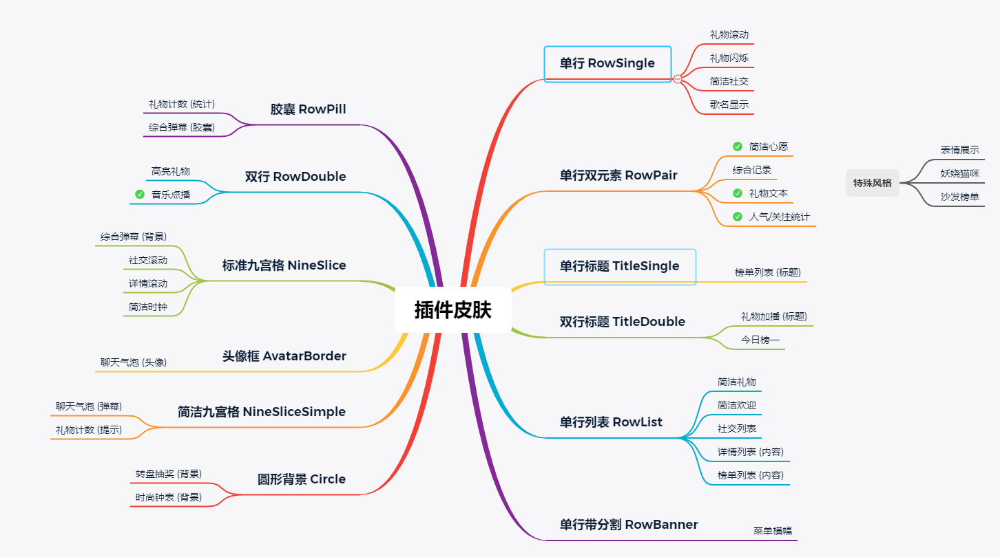

# 插件标准化调整

## 标准皮肤与插件对应关系

## 1.抽奖类

大转盘 LotteryWheel (wheel)
天选之人 LotteryLuckyman (luckyman)

## 2.弹幕类

### 聊天信息 \> 聊天气泡 ChatBubble (chitchat)

- [x] 设计全新标准皮肤，新建插件，旧插件列为遗产插件

## 3.礼物类

### 礼物列表 \> 高亮礼物 GiftHightLight (chitgift) （已有模板 换皮肤和颜色即可）

- [x] 设计标准双行皮肤，新建插件，旧插件列为遗产插件

### 最近礼物 \> 简洁礼物 GiftSimple (recentgift)

- [x] 设计全新标准皮肤，新建插件，旧插件列为遗产插件

### 滚动礼物 GiftScroll (footer)

- [x] 皮肤更改为标准单行皮肤，新建插件，旧插件列为遗产插件
    
- [x] 添加无背景皮肤
    

### 闪烁礼物 GiftFlash (giftrecentsimple) (直接更换为新皮肤)

- [x] 皮肤更改为标准单行皮肤，新建插件，旧插件列为遗产插件
    
- [x] 添加无背景皮肤
    

### 礼物计数 GiftCount (giftcount) （胶囊皮肤还没做好 暂时做不了）

- [ ] 设计全新标准皮肤，新建插件，旧插件列为遗产插件

### 礼物轮播 GiftCarousel

- [x] 新建插件

### 礼物提醒

## 4.综合类

### 综合弹幕 \> ComplexBoard (blive)

- [ ] 设计全新标准皮肤，旧插件下架

### 综合记录 \> ComplexRecord (comprehen)

- [x] 皮肤更改为标准单行双子皮肤，新建插件，旧插件列为遗产插件

### 表情展示 \> ComplexIconShow (iconshow)（先不做）

- [x] 重做插件，旧插件下架

## 5.心愿类

### 简洁心愿 GoalSimple (goals)

- [x] 皮肤更改为标准单行双子皮肤，在原插件修改即可
    
- [x] 添加无背景皮肤
    

## 6.排行类

### 排行榜 \> 榜单列表 RankList (ranking)

- [x] 设计全新标准皮肤，新建插件，旧插件列为遗产插件

### 今日榜一 \> RankTop (top)

- [x] 设计全新标准皮肤，新建插件，旧插件列为遗产插件

### 妖娆猫 RankCat

### 沙发 RankSofa

## 7.欢迎类

### 简洁欢迎 WelcomeSimple (welcomestyles) (必须选择条件才能打开)

- [ ] 皮肤更改为标准单行皮肤，新建插件，旧插件列为遗产插件

## 8.统计类

### 人气/关注统计 StatSimple

- [x] 皮肤更改为标准单行皮肤，新建插件，旧插件列为遗产插件

## 9.社交类

### 简洁社交 SocialSimple

- [x] 皮肤更改为标准单行皮肤，在原插件修改即可
    
- [x] 添加无背景皮肤
    

### 社交列表 SocialList

- [ ] 皮肤使用rowListLi组件
- [ ] 添加物背景皮肤

### 社交公告板 SocailBoard

- [x] 皮肤更改为标准九宫格皮肤，新建插件，旧插件列为遗产插件

## 10.详情类

### 菜单横幅 DetailBanner

- [x] 设计全新标准皮肤，新建插件，旧插件列为遗产插件

### 礼物文本 DetailGift （之前就已经在用新的皮肤组件了 ，没法新建插件）

- [x] 皮肤更改为标准单行双子皮肤，新建插件，旧插件列为遗产插件
    
- [x] 添加无背景皮肤
    

### 详情列表 DetailList （可以做）

- [ ] 皮肤更改为标准多行带背景皮肤，新建插件，旧插件列为遗产插件
    
- [ ] 添加无背景皮肤
    

### 详情滚动 DetailScroll

- [x] 皮肤更改为标准九宫格皮肤，新建插件，旧插件列为遗产插件

## 11.音乐类

### 歌名插件 MusicNowPlaying

- [x] 皮肤更改为标准单行皮肤，在原插件修改即可
    
- [x] 添加无背景皮肤
    

### 音乐点播 MusicLyric

- [x] 皮肤更改为标准双行皮肤，新建插件，旧插件列为遗产插件
    
- [x] 添加无背景皮肤
    

## 12.按键类

键盘 MoniterKeyboard
鼠标 MoniterMouse
方向键 MoniterArrow
手柄 MoniterGamepad

## 13.时钟类

### 挂钟 \> 简洁钟表 ClockSimple

- [x] 设计全新标准皮肤

### 时尚钟表 ClockModern

- [ ] 设计全新标准皮肤

## 14.倒计时类

### 日期倒计时 CountDownDay

- [x] 皮肤标准化为单行皮肤，新建插件，旧插件列为遗产插件

### 倒计时 CountDownTime