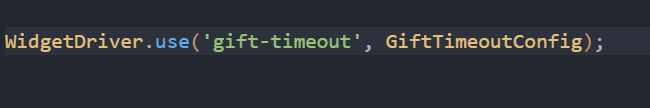
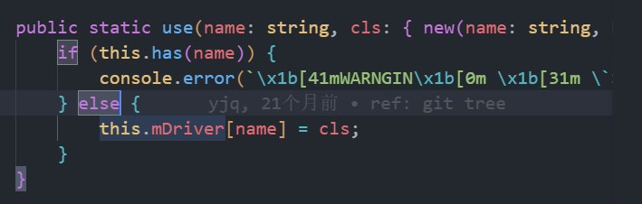
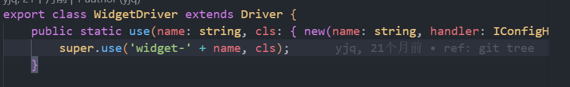
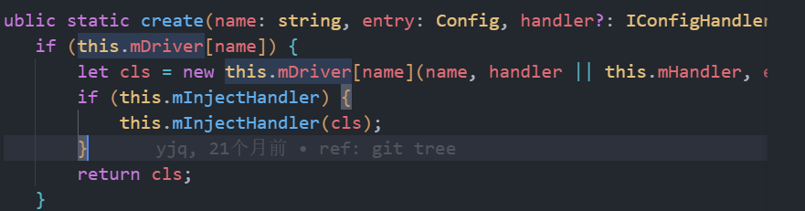

1. `this.mDriver[name] = cls` 这边的cls是我平时自定义的组件类，通用这个use方法会把这个自定义类传递进去

2. 当上面调用完use后，就会把所有的类都推入到mDriver这个对象中。

`this.mDriver[name] = cls 相当于 this.mDriver['widegt-gift-timeout'] = GiftTimeoutConfig`
3.实例化所有类，并传入参数

