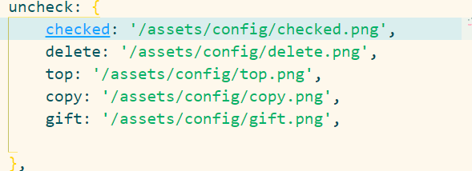

1. icon图标都有现成的 没有的去element-plus里面找
2. 组件拆分类似于element-plus的tabs标签页
3. 三个主题色 关于颜色的属性需要单独拿出来
4. 

## 图标显示
1. 直接让两个图标一个显示一个不显示，如果hover移入的话给第一个图标显示，第二个图标隐藏
2. 已点歌曲 已播记录 点播记录 的差别比较大 可能得把一些位置写成插槽的形式，不然不是很好实现共用。
3. 粉色皮肤的配置项和黑色皮肤配置项改为白色 ，白色皮肤配置项改为为灰色不变
4. 打钩打叉还需要不同的主题颜色 最上层的配置项也需要主题颜色 （还没配）
5. 添加两个功能 （提示信息弹起，点击加号添加歌曲）