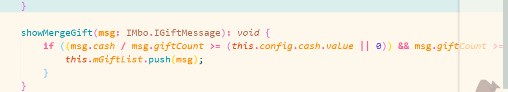
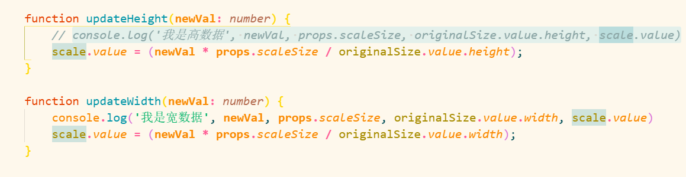
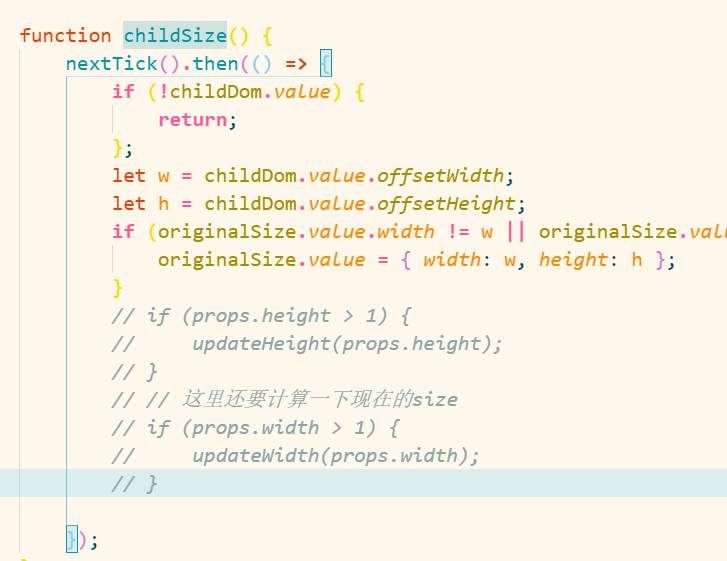

- ### ==recentgift.ts的数据有一些问题，就是当礼物数量低于某一个值的时候，不能累加!下面这一块处理有一些问题，有时间可以解决。==
    

### transformBox 的 增加行或缩小行会导致布局发生改变的问题

- 因为transformbox这个组件的宽高公用一个scale，所以会导致宽和高必须同步放大，所以现在需要把它修改成宽高不同步，不然没办法调整。
- ==调整transform下的如图代码即可：==

18/05/2022 18:04 （需要在 19/05/2022 18:05 解决 ）

- 很重要的一点就是，只要把宽高的放大scale分离，宽数据其实是没有任何变化的，而减小数量插件会变大的原因就是，originalsize（div的offsetHeight）的高度变小了，因为scale的值是除以originalsize得出的，所以导致scale的计算结果也就变大了，解决的办法就是将宽高的scale 写成两个，不能让宽高共享一个scale值。一旦共享就不能实现只增加宽，或只增加高的方法。

### 增加宽度没有问题，增加高度有问题
因为transformBox先执行宽度，在执行高度，所以增加宽度时，放大比例被后执行的高度覆盖，但高度变化，所以整体大小不变

问题解决，将初始化代码独立出去。

