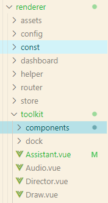
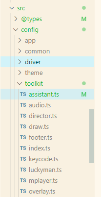
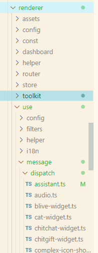
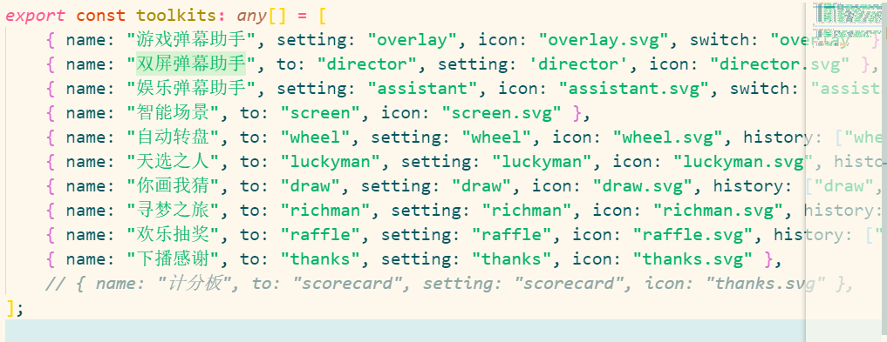
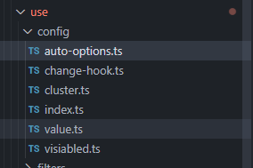
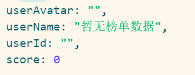
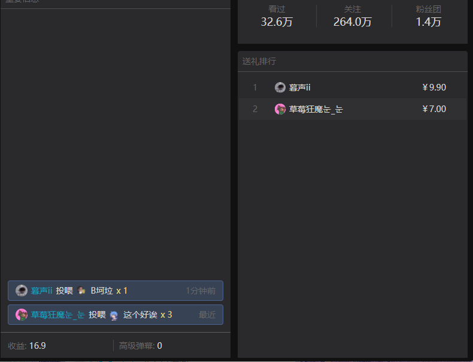

## 插件文件位置

1.  组件位置
    
2.  配置项位置
    
3.  数据位置
    
4.  各插件名如下
    
5. 放一些方法 例如在配置项后面加上东西，有关于配置项的

## 游戏弹幕助手 （组件名：Overlay） 参考

## 娱乐助手 （组件名：Assistant） （ 完成，有一个问题就是配置项中的跟娱乐助手中的配置项不一样）

1.  娱乐助手 增加榜单模块 toolkit文件夹中组件 （颜色可能需要修改）。
2.  下拉榜单 query中获取配置项。
3.  虎牙贵宾榜 B站高能榜 做测试 （刷新比较快）。
4.  榜单模块也要独立出组件 （已有组件，ranking-board）。
5.  数据来自useMessageOverlay() 在overlay组件中。
6.  ranking 数据是个数组，其中包括头像， 用户名，用户id，贡献值
    

## 双屏助手 （组件名：director） raking 一次最多就传七条数据

1.  跟娱乐助手同理，但是排版不一样，得封装新的组件。排版能显示几个显示几个（大概为10行）。
2.  组件左侧为头像用户名，右侧为贡献值。
3.  双屏助手的格式

- 类似于左侧格式，人民币改为贡献值，底部加上一行，类似于左侧面板
    