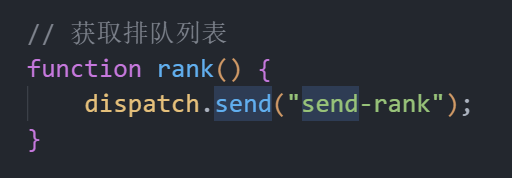

## 有bug的话需要记录
1. 三个操作按钮安按下后 没有马上操作列表 可能是我前端的问题 但时候排查一下 应该必须更新一下排行的数据
2. 可以加一个条件 顺序排队 和 礼物数量排队 （可以添加的）
3. 如果在排队中修改排队礼物的话 之前加入的所有人的礼物都会变 （礼物图片是前端获取的没有办法）
- [ ] 加入信息的动画不对 到时候调整一下

## 需要补充的
1. 礼物总数需要后台计算
2. 清空后台数据按钮方法 目前无法清空后台数据
3. 插件重启数据无缓存 因为关掉后重新送礼 同用户送礼还是从1开始累加·
4. 选中、置顶、删除按钮直接触发没反应 需要配合rank方法重新拉取最新数据 而不是后台直接重发
	- 需要这么写 才能正常使用

	- rank方法
	