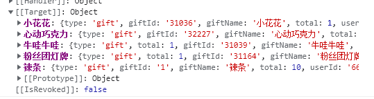

## 数据处理 (功能已实现)
1. 送指定礼物最多的人进行展示，后续如果有人送礼物数量一致，则进行覆盖，如果送礼物数量不超过则忽略。 （心愿的数据库信息中没有用户名，用户头像）同一种礼物应该放在同一个
2. 英雄榜类似于心愿目标，礼物都是指定的，第一名展示头像、名称和礼物数量。
3. 这个数据可以用于多份插件，多加一个插件，只展示第一个赠送指定礼物的粉丝，叫螃蟹榜
4. 需要读取当日的数据库记录，进行合并
5. 数据库中存储的没有头像，先展示默认空头像，后续同一观众赠送礼物则加上头像

 - 英雄榜 需要计算每一个人送的每一个的礼物的数量，并且将同一个礼物中的送礼最高数量的用户拿出来展示。应该返回一个对象，且对象中包含每个礼物key的对象
 - 螃蟹榜 这个相对简单，只需要记录第一个送指定礼物的人即可

## 前台页面（未开始）


## 如何使用
- 返回数据如下图所示

- 只需要遍历config配置项，因为gift-custom 名和 返回数据的key是一致的 
例如 设置的礼物名为giftName=>小心心 , 那么 heroRank[giftName] 即可拿到数据
```js
heroRank[giftName]?.total || 0      ==>  礼物总数 
heroRank[giftName]?.userAvator || '默认头像'     ==> 用户头像
heroRank[giftName]?.useName || '虚拟以待'   ==>  用户名
```