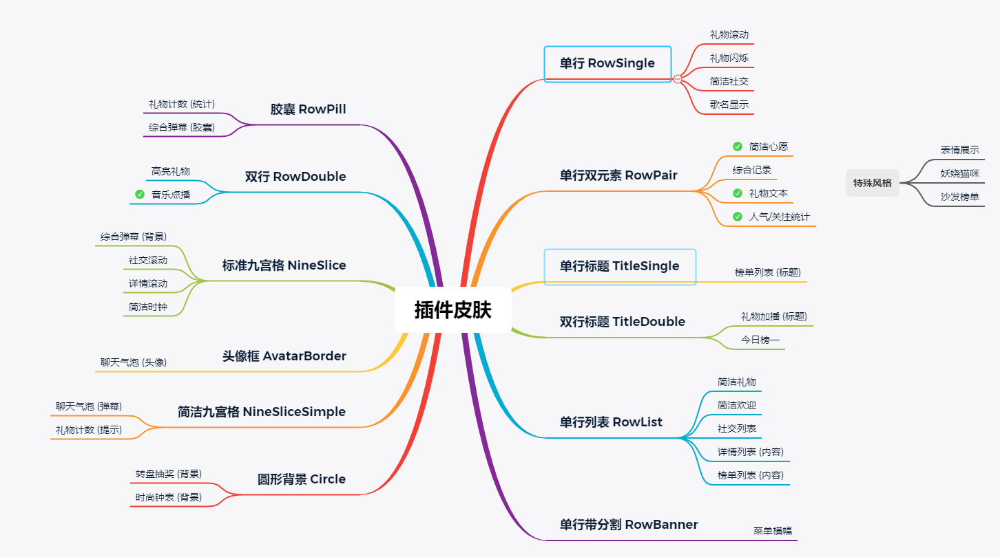

# 插件标准化调整

trapezoid: 斜角 (免费)
round: 圆角 (免费)
square: 方角 (免费)
none: 无背景
neon: 霓虹
technology: 科技
cat: 猫咪
cute: 可爱
spring: 春和
winter: 冬雪
magic: 魔法
fire: 火焰
genshin: 原神
constellation: 星座
rose: 蔷薇
graffiti: 涂鸦

## 标准皮肤与插件对应关系

## 抽奖类

大转盘 LotteryWheel (wheel)
天选之人 LotteryLuckyman (luckyman)

## 弹幕类

聊天信息 \> 聊天气泡 ChatBubble (chitchat)

- [x] 设计全新标准皮肤，新建插件，旧插件列为遗产插件

## 礼物类

礼物列表 \> 高亮礼物 GiftHightLight (chitgift) ==>改为礼物提醒

- [x] 设计标准双行皮肤，新建插件，旧插件列为遗产插件

最近礼物 \> 简洁礼物 GiftSimple (recentgift)

- [x] 设计全新标准皮肤，新建插件，旧插件列为遗产插件

滚动礼物 GiftScroll (footer)

- [x] 皮肤更改为标准单行皮肤，新建插件，旧插件列为遗产插件
- [x] 添加无背景皮肤

闪烁礼物 GiftFlash (giftrecentsimple)

- [x] 皮肤更改为标准单行皮肤，新建插件，旧插件列为遗产插件
- [x] 添加无背景皮肤

礼物计数 GiftCount (giftcount)

- [ ] 设计全新标准皮肤，新建插件，旧插件列为遗产插件
- [ ] 添加无背景皮肤

礼物轮播 GiftCarousel

- [ ] 新建插件
- [ ] 添加无背景皮肤

礼物加播 GiftTimeout

- [ ] 新建插件
- [ ] 添加无背景

## 综合类

综合弹幕 \> ComplexBoard (blive)

- [ ] 设计全新标准皮肤，旧插件下架

综合记录 \> ComplexRecord (comprehen)

- [ ] 皮肤更改为标准单行双子皮肤，新建插件，旧插件列为遗产插件

表情展示 \> ComplexIconShow (iconshow)

- [x] 重做插件，旧插件下架

## 心愿类

简洁心愿 GoalSimple (goals)

- [x] 皮肤更改为标准单行双子皮肤，在原插件修改即可
- [x] 添加无背景皮肤

## 排行类

排行榜 \> 榜单列表 RankList (ranking)

- [x] 设计全新标准皮肤，新建插件，旧插件列为遗产插件

今日榜一 \> RankTop (top)

- [ ] 设计全新标准皮肤，新建插件，旧插件列为遗产插件

妖娆猫 RankCat
沙发 RankSofa

## 欢迎类

简洁欢迎 WelcomeSimple (welcomestyles)

- [ ] 皮肤更改为标准单行皮肤，新建插件，旧插件列为遗产插件

## 统计类

人气/关注统计 StatSimple

- [x] 皮肤更改为标准单行皮肤，新建插件，旧插件列为遗产插件

## 社交类

简洁社交 SocialSimple

- [x] 皮肤更改为标准单行皮肤，在原插件修改即可
- [x] 添加无背景皮肤

社交列表 SocialList

- [ ] 用排行榜条列实现

社交公告板 SocailBoard

- [x] 皮肤更改为标准九宫格皮肤，新建插件，旧插件列为遗产插件

## 详情类

菜单横幅 DetailBanner

- [x] 设计全新标准皮肤，新建插件，旧插件列为遗产插件

礼物文本 DetailGift

- [x] 皮肤更改为标准单行双子皮肤，新建插件，旧插件列为遗产插件
- [x] 添加无背景皮肤

详情列表 DetailList

- [ ] 皮肤更改为标准多行带背景皮肤，新建插件，旧插件列为遗产插件
- [ ] 添加无背景皮肤

详情滚动 DetailScroll

- [x] 皮肤更改为标准九宫格皮肤，新建插件，旧插件列为遗产插件

## 音乐类

歌名插件 MusicNowPlaying

- [x] 皮肤更改为标准单行皮肤，在原插件修改即可
- [x] 添加无背景皮肤

音乐点播 MusicLyric

- [x] 皮肤更改为标准双行皮肤，新建插件，旧插件列为遗产插件
- [x] 添加无背景皮肤

## 按键类

键盘 MoniterKeyboard
鼠标 MoniterMouse
方向键 MoniterArrow
手柄 MoniterGamep