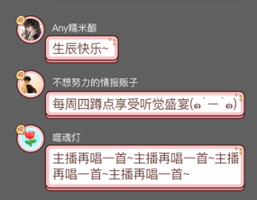
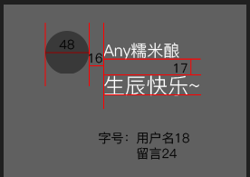

# NineSliceSimple 组件封装

## 示例图

## 需要注意的点

- ### 当文本框上部有文字时，头像框的中线在文字和文本框之间。当文本框上面的文字消失时，将头像框往下移动，将其中线对准文本框的中线。
    
- ### 当文字超出一固定的宽度时，差不多14个字的长度会自动换行，所以需要有一个固定的宽度。
    

## 封装思路

- ### 外部用大框包裹起来，将头像框移动到相应的位置，当文字消失时，移动的距离清空，头像框还原位置。
    
- ### 父组件传值 需要传递 theme（皮肤属性） display （布尔值-决定是否展示文字）
- ### 设置头像框的两种状态，当不显示外部文本时，样式添加dispaly：flex，如果显示文本时，将头像框从上往下移动