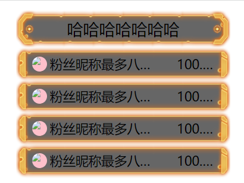
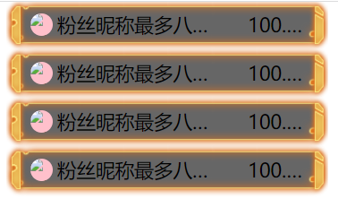

# RowList、RowListLi 组件的使用

## 1\. RowList 组件

## props

- ### theme ：string （皮肤名称）
    
- ### display：boolean （默认为true显示标题内容，false则不显示）
    

> # display为true显示： 
> 
> # display为false显示：

## slot

- ### head： 提供head插槽，插入的内容出现在标题框中。
    
- ### default：提供默认插槽 ，可自由填充内容
    

## 2\. RowListLi 组件 （一般嵌套在RowList中使用，可单独使用）

## props

- ### theme ：string （皮肤名称)
    
- ### avatar : string (头像的url地址)
    

## slot

- ### default：提供默认插槽 ，可自由填充内容。
    

* * *

## 3\. 用法案例

```
<script lang='ts' setup>
<RowList>
    <template v-slot:head>
      <span slot="head">哈哈哈哈哈哈哈</span>
    </template>
    <RowListLi v-for="a in 4" :key="a" class="aaa">
      <div class="fan-name">粉丝昵称最多八字dsa1</div>
      <div class="follow">
        <div class="follow-li">100.2.5万</div>
      </div>
    </RowListLi>
  </RowList>
  
</script>
 
<style  scoped>
.fan-name {
  width: 60%;
  overflow: hidden;
  text-overflow: ellipsis;
}
.follow {
  flex-grow: 1;
  height: 70px;
  display: flex;
  justify-content: flex-end;
}
.follow-li {
  width: 70px;
  text-align: end;
  overflow: hidden;
  text-overflow: ellipsis;
}
</style>

```

* * *