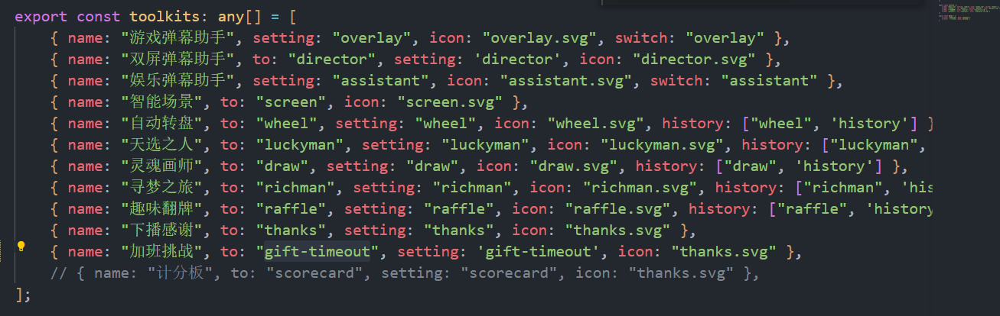

## 礼物加播需求

1.  use 中的 timeout 是当前剩余时间（秒数）
2.  双行标题加一个单行列表 （皮肤组件）
3.  根据配置项里面的礼物来增加时间或减少时间。
4.  最大单位为小时，最小单位为秒。例如：剩余时间35小时8分钟54秒。
5.  总共需要写两个地方，一个是外层插件加班挑战，一个是内层插件礼物加播。
6.   送礼物加时间或者减时间时，重新计算秒数，并重新调用时间转换函数、
7.   相应的名称和所在的文件夹
 
 
 
 
 问题：赠送数量和时间没有做关联（未解决）
 
 
 