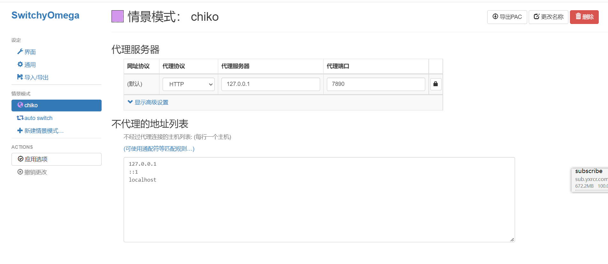
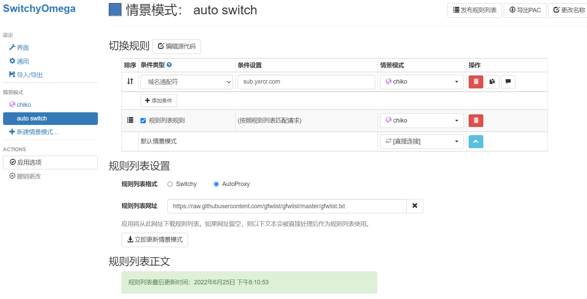

## 科学上网
1. ==clash for windows== 用来配置代理，非常好用！！（百度网盘中有备份）
2. ==SwitchyOmega== 浏览器插件，用来管理代理，非常好用！！
### 代理购买网址：
1. https://www.cryxr.xyz/#/dashboard （探索者，88年费可以冲）
2. https://my.bohe7.net/#/login （薄荷7，一般）
3. https://jike0001.com/user （极客云，推荐）

> clash for windows的配置非常简单，不需要介绍。但是它有个缺点就是所有的请求都走代理，这不仅会造成代理网络的大量使用，同时当代理网络不好的时候，也会导致国内的网页请求卡顿。解决方法就是配置SwitchyOmega。

### SwitchyOmega配置

> 参考网址 https://maofun.com/739.html

1.  在情景模式中新建一个配置如下图：
    
2.  在auto switch 中配置如下图：
    
3.  需要添加不走代理的规则列表，网址如下：
    https://raw.githubusercontent.com/gfwlist/gfwlist/master/gfwlist.txt

完成！！！