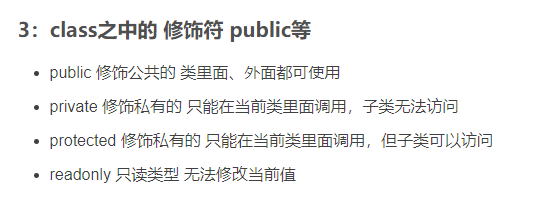

# 类的理解 （类的作用就是为了实例化出对象）
1. #### js 类中的数据是不能通过类直接访问的，除非属性前面加上static修饰符
2. #### 类中的属性和方法通过实例化对象后访问，要不就是通过get将值传出
3. #### 类不能访问到对象中的信息，但是对象可以修改类中的静态信息
4. #### 类的实例化对象中的原型属性访问的原型空间中有constructor属性，通过这个属性可以访问到类的中的static属性，也就是访问到直接写在类上的属性与方法
5. #### constructor构造函数中的this属性会被实例化成对象中的属性。因为这个this的指向是构造出来的实例化对象。
6. #### this 只能在函数，方法和类的构造函数中写
7. #### 修改person类原型对象中的属性值 它所构建出来的实例对象所指的原型对象属性也会改变，因为它们所指向的地址一致。
8. #### js 往class内部写方法， 本质上就是， 往函数prototype属性所指向的对象中写方法，所以实例化出来的对象是可以访问class内部的所有方法的。除非class 内部的方法是私有或者保护的。

## 修饰符

私有和被保护的属性在外部是不能直接被访问到，但是可以通过公有的函数将这个值return出去，通过这种方式来访问。用get,set的方式也可以访问。
