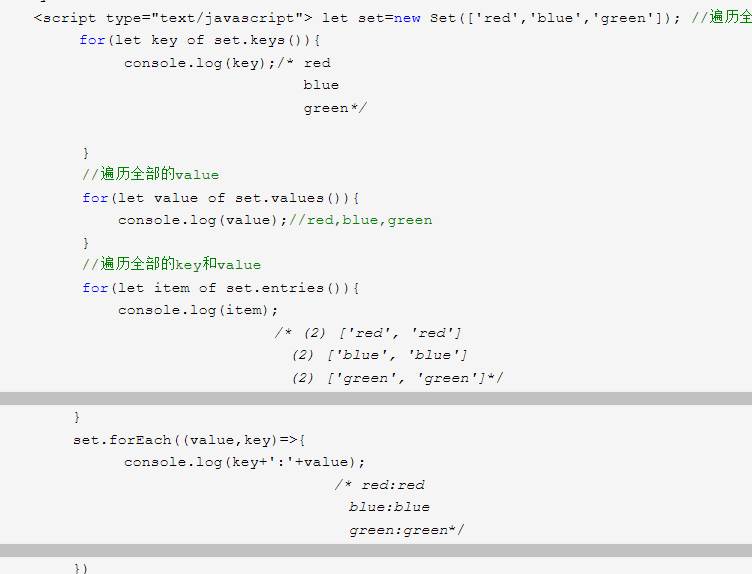
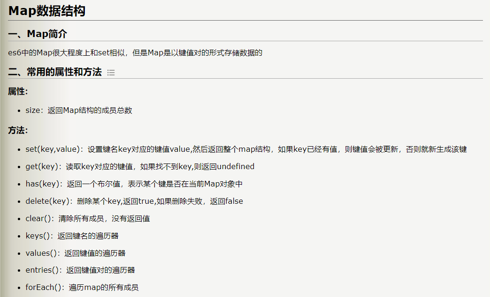
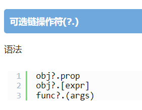

# 零碎知识点整合

## 循环

### for循环

- for循环中的i++ 是等{}代码块中的代码执行完毕后才开始执行的，所以下列式子最终输出0-9。

```js
for(let i=0; i<arr.length;i++) {
    console.log(i)
    //i++ 其实是在这个地方才执行的
}
```

### while循环

- while循环和for循环能实现一致的效果
- 下面的代码和上面的for循环一个道理

```js
let i = 0
while(let i<arr.length) {
    console.log(i)
    i++
}
```

### do while 循环

- 循环至少执行一次，即便条件为 false，因为代码块是在条件语句判断前执行。

```js
let i = 0
do{
    console.log(i)
    i++
}while(i<arr.length)
```

* * *

## 解构妙招

```js
 [arr[j], arr[j + 1]] = [arr[j + 1], arr[j]] 
//这样写可以直接互换，等同于下面的写法
  change = arr[j]
  arr[j] = arr[j + 1]
  arr[j + 1] = change
```

* * *

## Set、Map对象

> [set、map博客](https://www.cnblogs.com/heitu-k/p/15408760.html)
> set类似于js数组，map类似与js对象

### Set

- #### 基本语法
    


- #### 方法使用
    

通过这四个方法返回的遍历器可以通过for...of 遍历,当然set对象本身也是可以通过 for...of 遍历的。



- #### set 和 map 都可以通过链式调用
    

```js
let newSet =  new Set([1,2,3])
//链式调用，map同理
newSet.add(4).add(5).delete(1)
```

### Map

- #### 基本语法
    

> 具体知识看博客，看书。



* * *

### 可选链

> [可选链博客](https://blog.csdn.net/qq_40657321/article/details/115702528)

- #### 语法
    



- #### 案例
    


- #### 作用
    

1.  当访问的对象深度比较深时，可以用到可选链 。可选链的原理就是当访问的某一层数据不存在时，不会报错，而是会返回undefined。
    
2.  这样的话就可以访问很多接口的数据了，可选链是Es6的新特性，可以正常使用，并不会出现什么问题，我以前以为是ts或者vue的特性，其实是es6的特性。
    

* * *

### 多个数组方法的返回值

> [数组的多种方法的返回值](https://www.jb51.net/article/109833.htm)

- #### map、filter、some、every、forEach、for...in、for...of
    


- #### 方法理解
    
    1.  前五个方法都可以接收三个参数 分别是 数组中的每个元素，元素的索引值 ，数组本身。
        
    2.  map 和 fliter 都返回一个新数组，map 有返回值 ，map将数组中的每一项经过处理 然后返回一个全新的数组
        
    3.  filter 有返回值，filter将数组中的每一项做判断，然后retrun 如果符合条件 也就是retrun 1 ，如果不符合条件 retrun 0 ，然后将retrun1 的数据重新整合到一个新数组中。
        

* * *

### 栈内存、堆内存

- #### 栈内存
    

> let a = 10 ; let b = a ; a= 100 虽然后续a改变了，但是b不会改变 基本数据类型两个数据是独立的没有关联。


- const app = {} 为什么可以修改？因为当对象赋值给一个变量名时，其实是把自身的指针赋值给了变量名。 也就是说app其实是等于栈内存中一个指针，而这个指针会指向堆内存中的某一块空间，数据也都是存储在这一块空间中，所以只要不改变const app的指针，堆内存空间中的数据是可以随便修改的。
- 因为这个特性，所以当一个对象赋值给另外一个变量名时，其实本质就是把自身的指针赋值给另外一个变量名 ，这样的话两个对象共享同一个指针，所以它们会指向同一个空间，修改其中一个对象，另外一个对象也会发生改变。
- 栈内存中的基本数据类型都是相互独立的，所以它们之间互不影响。就算是用一个变量赋值给另外一个变量，它们之间也没有任何关联，无非就是初始值会一样，后续修改任何一方都对其他一方那个没有任何影响。