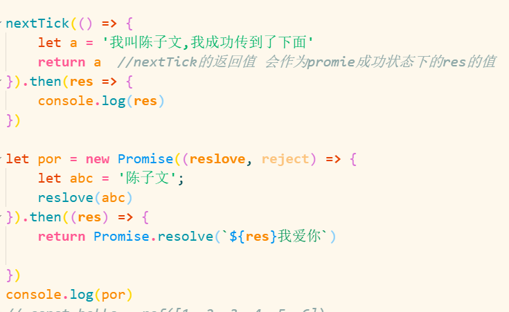

#### 计算属性典型的get set用法
```js
let hi = ref('chenziwen')
const hello = computed({
    get() {
        return hi.value

    },
    set(val: string) {
        hi.value = val
        console.log('我被修改了')
    }
})
hello.value = '5555'
console.log('修改成功?', hello.value,hi.value)
```

#### vue中的nextTick的返回值是promise值，所以可以通过点then去调用。
- vue 的 nextTick 其实是一个promise 所以可以调用then

-  vue 有缺点 nextTick 搭配 ：style 很难用 但是 js原生的dom.style 很好用

-   因为通过vue ：style设置的样式相当于写在dom里面 当nextTickdom更新后，就触发不了：style的更新 但是通过dom.style.样式 相当于通过js改变dom 所以它是会执行的




