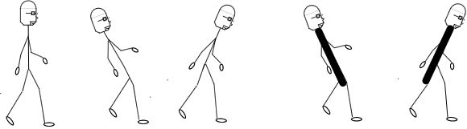

> 日常工作中，经常会分不清斜杆和反斜杆，在这里做一下总结。

反斜杠“\”是电脑出现了之后为了表示程序设计里的特殊含义才发明的专用标点。就是说，除了程序设计领域外，任何地方你都不应该有使用反斜杠的时候，请永远使用正斜杠“/”。

**如何区分呢？下面总结几个方法：**
1. 往前走路的为正斜杠，往后走路的为反斜杠

2. 斜率为正的是正斜杠，斜率为反的为反斜杠 （ps:斜率的计算方式为y/x）

**总结一下具体的情况：**
1. 在windows系统大部分情况下斜杠/和反斜杠\可以互用,特殊时候只能用反斜杠\；
2. 浏览器地址栏网址使用 斜杆/；
3. windows文件导航栏上使用 反斜杠\；
 4. 出现在html url() 属性中的路径，指定的路径是网络路径，所以必须用 斜杆/； (ps：如果url后面用反斜杠\，则不会显示任何背景)
5. 出现在普通字符串中的路径，如果代表的是windows文件路径，则使用 斜杆/ 和 反斜杠\ 是一样的；如果代表的是网络文件路径，则必须使用 斜杆/；

**相对路径和绝对路径**
==路径是以目录为单位，例如../表示当前目录的上一级目录==
./Images/  这样写表示，当前目录中的Images文件夹
../Images/ 这样写表示，当前目录的上一层目录中的Images文件夹
/Images/   这样写表示，项目根目录（可以指磁盘根目录，也可以指项目根目录，据实际情况而定）
 

