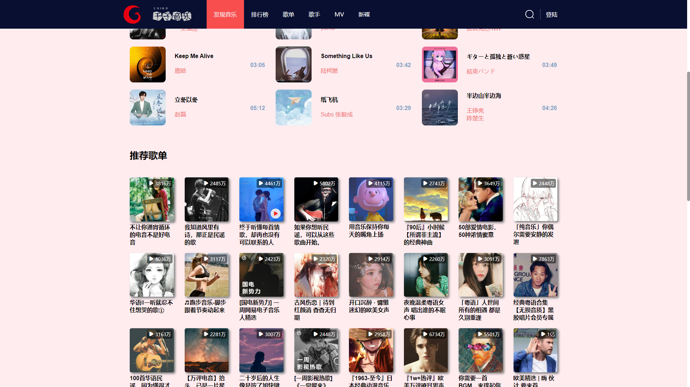
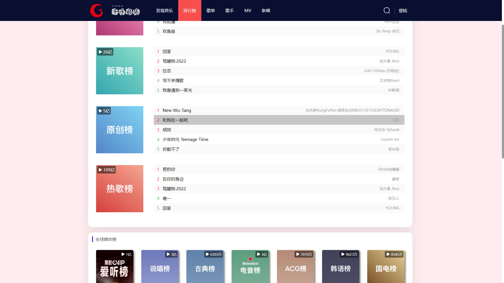
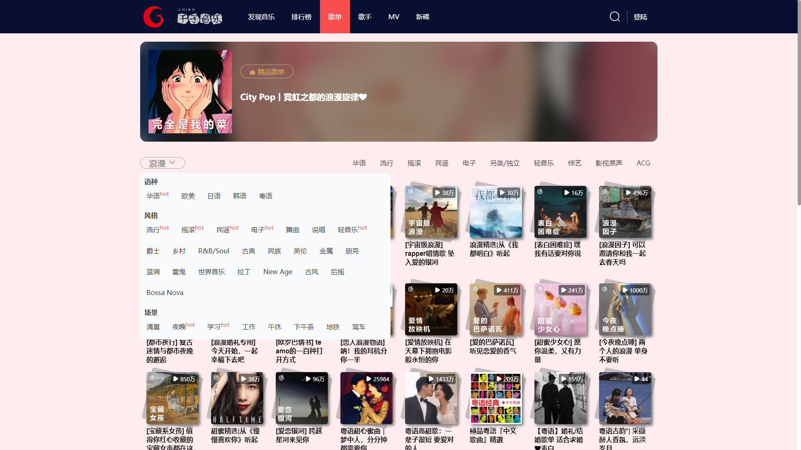
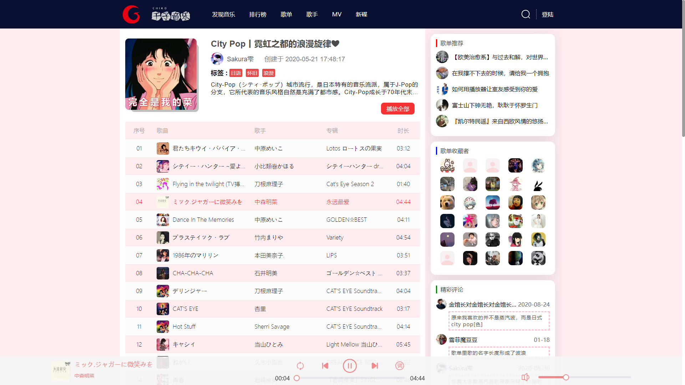
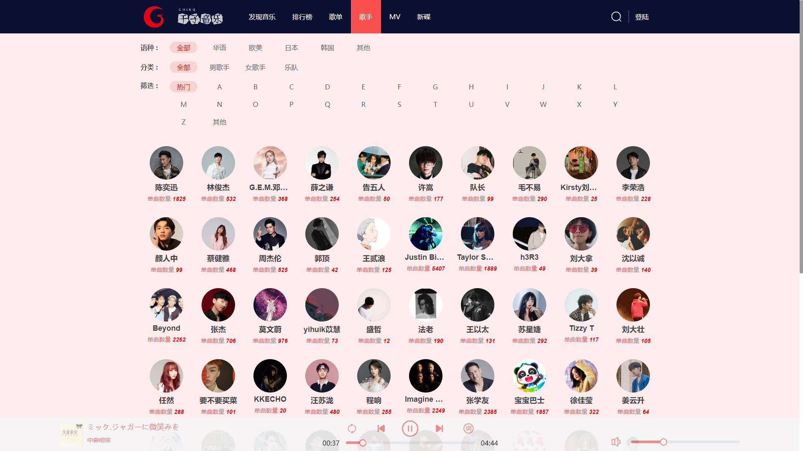

## 数据来源
- [NeteaseCloudMusicApi](https://github.com/Binaryify/NeteaseCloudMusicApi)
## 预览地址
- 暂无（还在持续开发中）
## 简单介绍
### 首页

### 排行榜

### 歌单



### 歌手


## 目录结构
- 暂无（开发完成会提供）
## 安装运行
```git
$ git clone https://github.com/Binaryify/NeteaseCloudMusicApi
$ cd NeteaseCloudMusicApi
$ npm install
$ node app.js
$ git clone git@github.com:chen-ziwen/chiko_music.git
$ cd CHIKO_MUSIC
$ npm install
$ npm run dev
```
